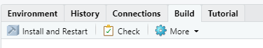
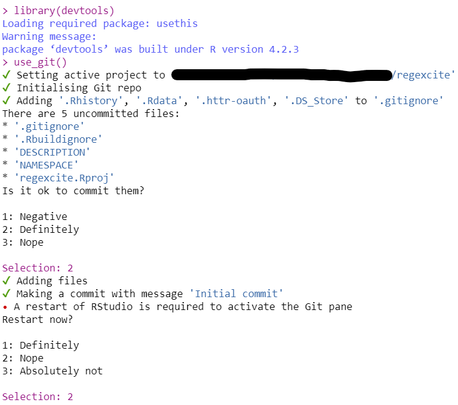
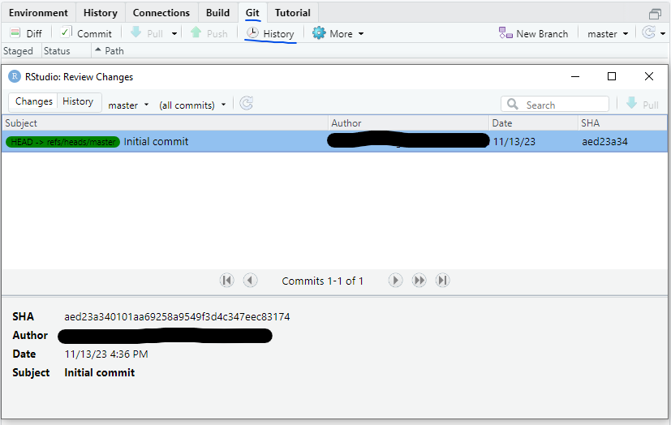

# The whole game

**We are going to create a toy package to:**

1. Paint the Big Picture and suggest a workflow for **developing a package.**
2. **Understand the process** to develop, document, and test a function.
3. Describe the process to **install and experiment** with a package's functions.
4. Show how to share our packages on **Github**.

## Common features seen packages

* Functions to address a specific need.
* Version control and an open development process maybe using **Git** and **Github**.
* Established workflows to:
  * Document each function using tools like **roxygen2**.
  * Document the package as whole using vignettes, markdown files (like `README.md` and `NEWS.md`) and package websites.
  * Test the code using tools like **testthat**.
  
## Creating a folder for the regexcite package

1. Install and confirm your current version of **devtools**.

```r
if(!"devtools" %in% rownames(installed.packages())) install.packages("devtools")

packageVersion("devtools")
```

* Latest version as of the writing of these notes is  [2.4.5](https://github.com/r-lib/devtools/releases/tag/v2.4.5).


2. **Create a new package folder** outside of any RStudio Project, R package, Git repo, or, OneDrive/GoogleDrive sync folder. If you are in an RStudio project you can use the next code to create the folder outside your project.

```r
usethis::create_package("../regexcite")
```




* Files created (options to view 'dotfiles')
   - `.Rbuildignore`: Files ignored when the package is built from source. 
   - `.Rproj.user`: A directory used by RStudio
   - `.gitignore`: A file to ignore files for version control.
   - `DESCRIPTION`: Provides metadata about your package. 
   - `NAMESPACE`: Declares functions to export and external functions to import from other packages. 
   - `R`: Will hold all of the `.R` files with function definitions.
   - `projectName.Rproj`: File that makes this directory a project with relative paths. 
  

## Starting git

3. Load **devtools** in the regexcite's project with `library(devtools)`.

4. Create the directory `.git` and create your first commit by calling `use_git()`.



5. Confirm your results.


 



## Defining first function

6. Call `use_r("funtion_name")` create a script below the `R/` subdirectory.

```r
use_r("strsplit1")
# ✔ Setting active project to 'C:/regexcite'
# • Modify 'R/strsplit1.R'
# • Call `use_test()` to create a matching test file
```

7. **Define the function** in the new file.

```r
strsplit1 <- function(x, split) {
  strsplit(x, split = split)[[1]]
}
```

8. Load all your functions by calling `load_all()` as it simulates the process of **building**, **installing**, and **attaching** the regexcite package.

```r
> load_all()
ℹ Loading regexcite

(x <- "alfa,bravo,charlie,delta")
#> [1] "alfa,bravo,charlie,delta"

strsplit1(x, split = ",")
#> [1] "alfa"    "bravo"   "charlie" "delta"
```

9. **Commit the changes** using the terminal (alt + shift + m).

```
# Select all changes
git add .

# Commit the changes
git commit -m "Creating the strsplit1 function"

# Show changes applied
git diff HEAD~1..HEAD
```

## Updating package metadata

10. *Make sure that your package can be installed* by running `R CMD check .` on your terminal, calling `check()` in your console or clicking over the `Check` button (Ctrl + Shift + E) of *Build* menu.

```r
check()

── R CMD check results ───────────────── regexcite 0.0.0.9000 ────
Duration: 58.7s

❯ checking DESCRIPTION meta-information ... WARNING
  Non-standard license specification:
    `use_mit_license()`, `use_gpl3_license()` or friends to pick a
    license
  Standardizable: FALSE

0 errors ✔ | 1 warning ✖ | 0 notes ✔
```

11. Update the `DESCRIPTION` file.

|**Section**|**From**|**To**|
|:----------|:-------|:-----|
|Title|What the Package Does (One Line, Title Case)|Make Regular Expressions More Exciting|
|Authors@R|person("First", "Last", , "first.last@example.com", role = c("aut", "cre"),<br>  comment = c(ORCID = "YOUR-ORCID-ID"))|person("Angel", "Feliz", , "angel@example.com", role = c("aut", "cre"))|
|Description|What the package does (one paragraph)|Convenience functions to make some common tasks with string manipulation and regular expressions a bit easier.|

12. **Pick any license** as experienced developers won't touch unlicensed code because *they have no legal right to use it*.

```r
use_mit_license()
#> ✔ Adding 'MIT + file LICENSE' to License
#> ✔ Writing 'LICENSE'
#> ✔ Writing 'LICENSE.md'
#> ✔ Adding '^LICENSE\\.md$' to '.Rbuildignore'
```

## Documenting and exporting functions

13. If you use RStudio, select the function to document and click on `Insert Roxygen`.


14. Update the documentation and add an example.

```
#' Split a string
#'
#' Takes the first result of the base::strsplit function.
#'
#' @param x A character vector with one element.
#' @param split What to split on.
#'
#' @return A character vector.
#' @export
#'
#' @examples
#' x <- "alfa,bravo,charlie,delta"
#' strsplit1(x, split = ",")
```

15. Run `document()` or *Build > More > Document* (ctrl + shift + d) to:
 - Build the `man/strsplit1.Rd` file.
 - Update the ``NAMESPACE` file based on `@export` tags found in roxygen comments.

```r
document()
# ℹ Updating regexcite documentation
# ℹ Loading regexcite
# Writing NAMESPACE
# Writing strsplit1.Rd
```

16. Run `?strsplit1` to see the result and `check()` to validate your package's status. 


## Testing our package functions

17. Call `use_testthat()` sets up the testing framework by:
  - Adding Suggests: testthat to DESCRIPTION
  - Creating the directory `tests/testthat/`
  - Adding the script `tests/testthat.R`. 
  - Updating the `DESCRIPTION`

18. Call `use_test("strsplit1")` to create the file `tests/testthat/test-strsplit1.R` where we are going to write our test.

19. Change the test's description and update the test.

```r
test_that("strsplit1() splits a string", {
  expect_equal(strsplit1("a,b,c", split = ","), c("a", "b", "c"))
})
```

20. Run the test by calling `test()` or `check`.

```r
test()
# ℹ Testing regexcite
# ✔ | F W S  OK | Context
# ✔ |         1 | strsplit1 [0.1s]                                                        
# 
# ══ Results ═══════════════════════════════════════════════════
# Duration: 0.1 s
# 
# [ FAIL 0 | WARN 0 | SKIP 0 | PASS 1 ]
# 
# 🔥 Your tests are lit 🔥
```

## Using functions from other packages

> To use functions from other packages you need to use the next explicit syntax package_name::function() even form default packages like `stats` and `utils`.

21. Call `use_package("stringr")` to update the `DESCRIPTION` file.

22. Rename the function's source and test files by calling `rename_files("old_name", "new_name")`

```r
rename_files("strsplit1", "str_split_one")
# ✔ Moving 'R/strsplit1.R' to 'R/str_split_one.R'
# ✔ Moving 'tests/testthat/test-strsplit1.R' to 'tests/testthat/test-str_split_one.R'
```

23. Update the `R/str_split_one.R` file.

```r
#' Split a string
#'
#' @param string A character vector with, at most, one element.
#' @inheritParams stringr::str_split
#'
#' @return A character vector.
#' @export
#'
#' @examples
#' x <- "alfa,bravo,charlie,delta"
#' str_split_one(x, pattern = ",")
#' str_split_one(x, pattern = ",", n = 2)
#'
#' y <- "192.168.0.1"
#' str_split_one(y, pattern = stringr::fixed("."))
str_split_one <- function(string, pattern, n = Inf) {
  stopifnot(is.character(string), length(string) <= 1)
  if (length(string) == 1) {
    stringr::str_split(string = string, pattern = pattern, n = n)[[1]]
  } else {
    character()
  }
}
```

24. Update the `tests/testthat/test-str_split_one.R'` file.

```r
test_that("str_split_one() splits a string", {
  expect_equal(str_split_one("a,b,c", ","), c("a", "b", "c"))
})

test_that("str_split_one() errors if input length > 1", {
  expect_error(str_split_one(c("a,b","c,d"), ","))
})

test_that("str_split_one() exposes features of stringr::str_split()", {
  expect_equal(str_split_one("a,b,c", ",", n = 2), c("a", "b,c"))
  expect_equal(str_split_one("a.b", stringr::fixed(".")), c("a", "b"))
})
```

25. Run `check()` to `document()`, `load_all()`, `test()` and validate all the changes applied.

```r
check()

str_split_one("a, b, c", pattern = ", ")
# [1] "a" "b" "c"
```

## Sharing the package in Github

26. Run `use_github()` to update the `DESCRIPTION` file and creating a new repo on `Github`.

```r
use_github()

# ℹ Defaulting to 'https' Git protocol
# There are uncommitted changes and we're about to create and push to a new GitHub repo
# Do you want to proceed anyway?
# 
# 1: For sure
# 2: No way
# 3: Nope
# 
Selection: 1
# ✔ Creating GitHub repository 'AngelFelizR/regexcite'
# ✔ Setting remote 'origin' to 'https://github.com/AngelFelizR/regexcite.git'
# ✔ Setting URL field in DESCRIPTION to 'https://github.com/AngelFelizR/regexcite'
# ✔ Setting BugReports field in DESCRIPTION to 'https://github.com/AngelFelizR/regexcite/issues'
# There is 1 uncommitted file:
# * 'DESCRIPTION'
# Is it ok to commit it?
# 
# 1: Absolutely
# 2: Absolutely not
# 3: No way
# 
Selection: 1
# ✔ Adding files
# ✔ Making a commit with message 'Add GitHub links to DESCRIPTION'
# ✔ Pushing 'master' branch to GitHub and setting 'origin/master' as upstream branch
# ✔ Opening URL 'https://github.com/AngelFelizR/regexcite'
```

27. Run `use_readme_rmd()` to:
  - Create the source file for package home page on Github.
  - Add some lines to .Rbuildignore
  - Create a Git pre-commit hook to help you keep README.Rmd and README.md in sync.

```r
use_readme_rmd()
# ✔ Writing 'README.Rmd'
# ✔ Adding '^README\\.Rmd$' to '.Rbuildignore'
# • Modify 'README.Rmd'
# ✔ Writing '.git/hooks/pre-commit'
```

28. Update the `README.Rmd` with stuff liberally from `DESCRIPTION` and any formal and informal tests or examples you have.

29. Render the `README.md` file with by calling `build_readme()` or use GitHub Actions to re-render `README.Rmd` every time you push.

30. Call `check()` to validate the changes and push the changes Github.


## Summary

|**Setup Package**|**Setup Functions**|**Validation**|
|:----------------|:------------------|:-------------|
|- `create_package()` <br> - `use_git()` <br> - `use_mit_license()` <br> - `use_testthat()` <br> - `use_github()` <br> - `use_readme_rmd()`|- `use_r()` <br> - `use_test()` <br> - `use_package()`|- `load_all()` <br>  - `document()` <br> - `test()` <br> - `check()`|


## Meeting Videos

### Cohort 1

`r knitr::include_url("https://www.youtube.com/embed/FR6NsbkYhcw")`


### Cohort 2

`r knitr::include_url("https://www.youtube.com/embed/7YgH8qfyzFU")`


### Cohort 3

`r knitr::include_url("https://www.youtube.com/embed/3vdXk_tYG-g")`

<details>
<summary> Meeting chat log </summary>

```
00:13:51	Ryan Metcalf:	I can get the ball rolling, I can try chapters 3 & 4.
00:35:53	Ryan Metcalf:	Maybe load `use this`?
00:44:13	Brendan Lam:	R4DS is my main reference for writing functions
00:44:46	Rex :	looking at other packages source code - but those with s3/s4 methods I find trickier to decipher)
00:47:27	Larissa Shaughnessy:	Collin I’m going to put something in the slack. I was digging through my docs for it while you were asking about resources - not sure if it gets into the complexity you are asking for but I do find the examples helpful
```
</details>


### Cohort 4

`r knitr::include_url("https://www.youtube.com/embed/UKASy8ynWvg")`

<details>
<summary> Meeting chat log </summary>

```
00:04:21	Oluwafemi Oyedele:	Hello, Good Evening !!!
00:21:15	Schafer, Toryn:	Is anyone not using RStudio?
00:21:36	Jamie:	I'm using Rstudio
00:21:46	Neil Birrell:	same here
00:21:48	Meenakshi Kushwaha:	me too
00:22:10	defuneste:	I am using emacs or rstudio
00:22:28	Jamie:	Just a note: ensure that the create_package() path is not already in a R project.
00:22:51	Schafer, Toryn:	Good advice, Jamie!
00:26:42	defuneste:	to git
00:26:48	Schafer, Toryn:	I think I had different responses 😅 someone was having fun with that
00:28:41	Ryan McShane:	great example; I was wrestling with strsplit outputting lists or matrices only today 😂
00:29:25	Schafer, Toryn:	I felt called out with the mention of source(“file.R”)
00:29:40	Ryan McShane:	and now it's obvious I didn't read the chapter (it's in 2.7, I'm seeing)
00:32:25	defuneste:	I use source() all the time attaching and reattaching the same library over and over :)
00:32:38	Jamie:	so check() tries to install the package right?
00:33:34	defuneste:	good question I am unsure
00:35:00	Schafer, Toryn:	I think so. From the help page it says it builds and then checks CRAN requirements
00:39:50	Schafer, Toryn:	Did anyone else get a note on there check() about “unable to verify current time”
00:40:16	defuneste:	> Like other license helpers, use_mit_license() also puts a copy of the full license in LICENSE.md and adds this file to .Rbuildignore
00:40:26	defuneste:	it was a quote
00:48:43	Schafer, Toryn:	I was manually adding things to a NAMESPACE in a local package before today 😅
00:49:12	Jamie:	How were you doing that? Doesn't it say read only?
00:50:02	Schafer, Toryn:	It’s not actually… I don't know. I can type in it and save
00:50:39	Jamie:	Good find :)
00:53:43	Schafer, Toryn:	if you wrap the examples in \dontrun{}, then it won't affect the check()... not sure if that is CRAN compliant, but if you have a computationally expensive function
00:54:26	Jamie:	Oh!! Nice one! I've always wondered why all examples start with dontrun! Thanks Torynm :)
00:54:37	Jamie:	*Toryn
00:57:15	defuneste:	I always do that by "hand"  and my readme are ugly
01:00:45	Jamie:	I have to go now. Thanks for a great session guys. Well done Oluwafemi. See you all next week :)
01:03:00	defuneste:	storm is here in Ohio be ready Chicago!
01:03:04	Schafer, Toryn:	Hey! We're still looking for someone to sign up for week 4: https://docs.google.com/spreadsheets/d/161KcusuKQlNcmYyjVszV6hdzBSJzDA6GpulS_Bj5RwU/edit#gid=0
01:03:25	Ryan McShane:	I can do week 4
01:04:40	defuneste:	it was great !
01:04:45	defuneste:	live coding is hard
01:05:36	Meenakshi Kushwaha:	thanks so much for the excellent demo!
01:05:54	defuneste:	yeah the used rename_file()
```
</details>


### Cohort 5

`r knitr::include_url("https://www.youtube.com/embed/WNIUmfvc5ws")`

<details>
<summary> Meeting chat log </summary>

```
00:09:00	Trevin Flickinger:	https://rstudio-conf-2022.github.io/build-tidy-tools/
00:19:57	Trevin Flickinger:	https://github.com/yogat3ch/UU
00:34:55	shamsuddeen:	https://www.warp.dev
```
</details>
