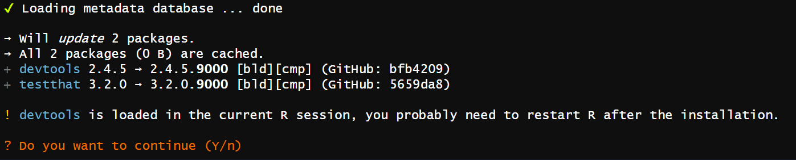

# System setup

**Learning objectives:**

-   Check which version of R you are using
-   Check which version of RStudio you are using
-   Use `{pak}` to install packages
-   Use `{devtools}` to simplify common package development tasks
-   Configure your `.Rprofile` to operate in developer mode
-   Set RStudio hotkeys for package development tasks
-   Enable a full build toolchain on your system
-   Find and fix issues with your developer setup

Note: These slides incorporate some content from [What They Forgot to Teach You About R](https://rstats.wtf/) by Jennifer Bryan, Jim Hester, Shannon Pileggi, and E. David Aja

## R version {-}

-   `R.Version()` (capital V) for list
-   `R.version` (lowercase v, no parens; alias = `version`) for simpler print
-   `R.version.string` for just the version
-   `sessionInfo()` for more details
-   {sessioninfo} package for more, prettier details

```{r, How to check your R version, eval=TRUE}
R.version.string
```

## RStudio Version {-}

-   [Download & install from posit](https://posit.co/download/rstudio-desktop/)

```{r system-setup-rstudio-version, eval=FALSE}
names(rstudioapi::versionInfo())
#> [1] "citation" "mode" "version" "long_version" "release_name"

rstudioapi::versionInfo()$version
#> [1] ‘2023.9.1.494’
```

## pak {-}

-   "Faster and more reliable" package installation
-   Deals with packages loaded in current session
-   Resolves system dependencies
-   `pak::pak("r-lib/devtools)`
-   `pak::pak()` = "update everything related to current project"



## devtools and friends {-}

`{devtools}`: "Tools to Make Developing R Packages Easier"

-   `{usethis}` (via Depends): "Automate Package and Project Setup"
-   `{remotes}`: (but use `{pak}` instead)
-   `{pkgbuild}`: "Find Tools Needed to Build R Packages"
-   `{pkgload}`: "Simulate Package Installation and Attach"
-   `{rcmdcheck}`: "Run 'R CMD check' from 'R' and Capture Results"
-   `{sessioninfo}`: "R Session Information"
-   `{testthat}`: "Unit Testing for R"
-   `{roxygen2}`: "In-Line Documentation for R"
-   `{lifecycle}`: "Manage the Life Cycle of your Package Functions"
-   `{pkgdown}`: "Make Static HTML Documentation for a Package"
-   `{profvis}`: "Interactive Visualizations for Profiling R Code"

## .Rprofile {-}

-   `usethis::use_devtools()`
-   ***DO*** include things to make development easier
-   ***DO NOT*** alter operation of analysis code (etc)

## Jon's .Rprofile {-}

```{r system-setup-jons-rprofile, eval=FALSE}
# Quick disable ----------------------------------------------------------------
# Comment this out and reload R to quickly turn things off.
options(jon_load_stuff = TRUE)

# My settings ------------------------------------------------------------------
# Don't set ANY of these when non-interactive
if (interactive() && getOption("jon_load_stuff", FALSE)) {
  ## Safer coding --------------------------------------------------------------
  options(
    warnPartialMatchArgs = TRUE,
    warnPartialMatchDollar = TRUE,
    warnPartialMatchAttr = TRUE
  )
  rlang::global_handle()

  ## Display -------------------------------------------------------------------
  options(
    continue = "  ",
    width = 80,
    tidymodels.dark = TRUE
  )

  ## usethis -------------------------------------------------------------------
  options(
    usethis.full_name = "Jon Harmon",
    usethis.description = list(
      `Authors@R` = 'person("Jon", "Harmon",
                          email = "jonthegeek@gmail.com",
                          role = c("aut", "cre"),
                          comment = c(ORCID = "0000-0003-4781-4346"))',
      License = "MIT + file LICENSE"
    ),
    usethis.destdir = "C:/Users/jonth/Dropbox (Personal)/R"
  )
  # Some things still want a GITHUB_PAT env var
  Sys.setenv(GITHUB_PAT = gitcreds::gitcreds_get()$password)

  ## Caching -------------------------------------------------------------------
  ## Technically these COULD change behavior so turn them off if something
  ## is weird in these packages.
  options(
    zoom.cache_disk = TRUE,
    yt_cache_disk = TRUE,
    tigris_use_cache = TRUE,
    styler.cache_root = "styler-perm"
  )

  ## Load packages -------------------------------------------------------------
  ## ONLY load dev-focused packages! Turn these off if you're working on a
  ## package that wraps any of these!
  suppressMessages(require(devtools))
  suppressMessages(require(reprex))
  suppressMessages(require(andthis)) # My personal usethis extension

  ## Branch & time in prompt ---------------------------------------------------
  ## pak::pak("prompt")
  prompt::set_prompt(
    function(...) {
      paste0(
        "[",
        prompt::git_branch(),
        " ",
        format(Sys.time(), "%T"),
        "] > "
      )
    }
  )

  ## Check to-dos in new RStudio session ---------------------------------------
  setHook(
    "rstudio.sessionInit",
    function(newSession) {
      if (newSession) {
        if (length(rstudioapi::getActiveProject())) {
          # I want to explicitly exclude revdep from the search.
          to_read <- fs::dir_ls(getwd()) |>
            stringr::str_subset("revdep$", negate = TRUE)

          todor::todor(search_path = to_read)
        }
      }
    },
    action = "append"
  )

  ## Current project quick-load ------------------------------------------------
  ## Name these with . so they don't show up in the global environment
  .nectar <- function() {
    andthis::open_proj("nectar")
  }
  .rapid <- function() {
    andthis::open_proj("rapid")
  }
  .bk <- function() {
    andthis::open_proj("beekeeper")
  }
  .api2r <- function() {
    .nectar()
    .rapid()
    .bk()
  }
}
```

## RStudio hotkeys {-}

-   `Ctrl + Shift + L` = `devtools::load_all()` (Section 4.4)
-   `Ctrl + Shift + D` = `devtools::document()` (Chapter 16)
-   `Ctrl + Shift + E` = `devtools::check()` (Section 4.5)
-   `Ctrl + Shift + B` = `devtools::install()` (Section 3.5)

## RStudio hotkeys: Tests {-}

`Tools > Modify keyboard shortcuts...`

-   Current `.R` file (or corresponding testthat file)
    -   "Run a test file": `Ctrl + T`
    -   "Report test coverage for a file": `Ctrl + R`
-   Entire package
    -   "Test package": `Ctrl + Shift + T`
    -   "Report test coverage for a package": `Ctrl + Shift + R`

More in chapter 13!

## R build toolchain {-}

-   Need compiler and related tools to install some packages from source
    -   These are system tools, not R packages
-   RStudio should help you set this up
-   [See book](https://r-pkgs.org/setup.html#setup-tools) for your OS

## Developer setup situation report {-}

```
[slides02-03 10:29:23] > dev_sitrep()
── R ─────────────────────────────────────────────────────────────────────────────────────────────────
• version: 4.3.2
• path: 'C:/Program Files/R/R-4.3.2/'
── Rtools ────────────────────────────────────────────────────────────────────────────────────────────
• path: 'C:/rtools43/usr/bin/'
── RStudio ───────────────────────────────────────────────────────────────────────────────────────────
• version: 2023.9.1.494
── devtools ──────────────────────────────────────────────────────────────────────────────────────────
• version: 2.4.5.9000
── dev package ───────────────────────────────────────────────────────────────────────────────────────
• package: 'bookclub-rpkgs'
• path: 'C:/Users/jonth/Dropbox (Personal)/R/bookclub-rpkgs/'
```

## Meeting Videos {-}

### Cohort 1 {-}

`r knitr::include_url("https://www.youtube.com/embed/3r-EPc9XqxE")`


### Cohort 2 {-}

`r knitr::include_url("https://www.youtube.com/embed/vfrAbmqjR1c")`


### Cohort 3 {-}

`r knitr::include_url("https://www.youtube.com/embed/SEJmtdIWC-g")`

<details>
<summary> Meeting chat log </summary>

```
00:10:39	Ryan Metcalf:	20C = 68F. Awesome Temp!
00:36:24	Brendan Lam:	12.3.1 is my version
00:37:54	Larissa Shaughnessy:	This just made me realize I need to update from 12.2 so thanks Brendan!
00:48:53	collinberke:	Package for styling your console messages: https://cli.r-lib.org/
01:05:50	Arun Chavan:	Mac
01:05:54	Isabella Velásquez:	Also Mac
01:05:59	Larissa Shaughnessy:	Mac
```
</details>


### Cohort 4 {-}

Chapters 3 and 4 were covered together.

`r knitr::include_url("https://www.youtube.com/embed/Trrc57hCtVo")`

<details>
<summary> Meeting chat log </summary>

```
00:10:54	defuneste:	bad connection tonight
00:12:27	defuneste:	I was there with Oluwafemi
00:12:49	defuneste:	my main take is that I should move to quarto
00:13:46	Jamie:	Good take defuneste. Three core reasons?
00:14:26	defuneste:	new stuff will not be implemented in rmd
00:14:46	defuneste:	and rmd will just be maintained
00:16:03	Jamie:	sweet!
00:16:06	Schafer, Toryn:	https://docs.google.com/spreadsheets/d/1AlgFwMR42NjjoG2lcm0hf_pk5ZACw-n8UCwnrny91bU/edit#gid=0
00:16:46	defuneste:	surprise test !
00:24:52	defuneste:	https://www.openblas.net/
00:28:49	Schafer, Toryn:	require is designed for use inside other functions; it returns FALSE and gives a warning (rather than an error as library() does by default) if the package does not exist.
00:36:30	defuneste:	https://gitlab.com/dickoa/prepr/
00:37:04	defuneste:	her it say windows user need to add rtools
00:37:23	defuneste:	as a linux users I nened to install gmp and mpfr
00:37:29	defuneste:	needed
00:47:28	defuneste:	https://xkcd.com/1168/
00:59:38	defuneste:	sudo su -c "R -e \"install.packages('devtools')\"" this in command line to instll a package from shell as a super user
01:02:01	defuneste:	see the lengthy manual : https://cran.r-project.org/doc/manuals/r-release/R-intro.html#Invoking-R-from-the-command-line
01:03:18	Schafer, Toryn:	"/Users/torynschafer/Library/R/x86_64/4.2/library"
01:03:48	Schafer, Toryn:	Sys.getenv("R_LIBS_USER")
01:04:13	defuneste:	"/home/defuneste/R/x86_64-pc-linux-gnu-library/4.2"
01:04:18	Ryan McShane:	Mine on Windows: 
"C:\\Program Files\\R\\library"
01:09:01	defuneste:	~/ is the same for me /home/defuneste/
01:10:25	Neil Birrell:	Sorry - I need to head off as someone else has booked the meeting room. Possibly a good question to add to the sheet as well :)
01:12:39	Oluwafemi Oyedele:	Thank you !!!
01:16:16	Howard Baek:	Thanks for coming!
01:16:45	Jamie:	Thanks everyone. I have to go now. See you next week.
01:18:50	Howard Baek:	Sorry I had to leave my desk! See everyone next week.
```
</details>
