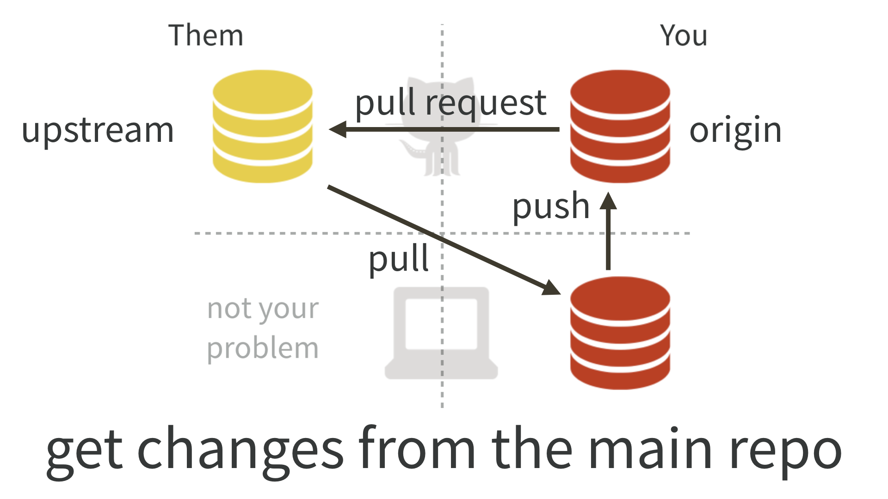
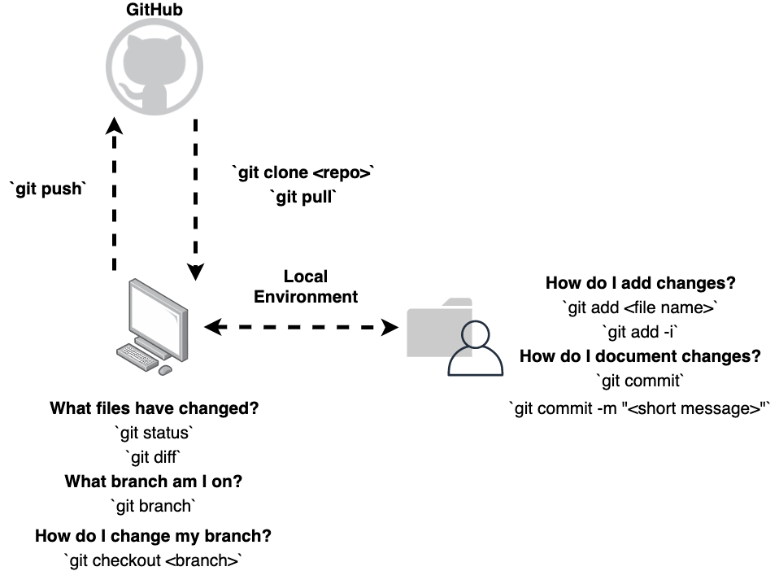

# The whole game

**Learning objectives:**

1. Become acquainted with the **entire workflow** for **developing a package.**
2. Observe the use of **some common functions** used in the **package development workflow.**
3. **Understand the process** to develop, document, and test a function.
4. Describe the process to **install and experiment** with a package's functions.
5. Discuss the roles **git and GitHub** play in the development of a package.

## Warmup/Ice breaker

- Do you say data ("day - ta"), data ("dah - ta"), or something else?

## A few reminders

* If we need to slow down and discuss, let me know.
   - If you have a question, most likely someone else will have the same question.
   - We are all here to learn.
* Camera is optional, but encouraged.
* Sessions are recorded and uploaded YouTube.
* See the pins in the Slack channel for the schedule and sign-ups.

## Load devtools and friends

```{r 02-load-devtools}
library(devtools)

# Check package version
packageVersion("devtools")
```

* Latest version as of the writing of these notes is  [2.4.3](https://github.com/r-lib/devtools/releases/tag/v2.4.3).

## What types of functions/tools are used during package development?

* Functions fulfilling a specific need.
* Functions used to facilitate the use of version control (i.e., `git` and `GitHub`).
* Functions to assist in the package development workflow.
   - Setting up the function file
   - Developing documentation (e.g. `roxygen2`)
   - Testing our code (e.g. `testthat`)
   - Using a `README.Rmd` file for documentation. 

## Create the package

* Use `usethis::create_package("~path/to/package)`
* **Before you run:** Consider where these files will be placed
* Files created (options to view 'dotfiles')
   - `.Rbuildignore`: Files ignored when the package is built from source. 
   - `.Rproj.user`: A directory used by RStudio
   - `.gitignore`: A file to ignore files for version control.
   - `DESCRIPTION`: Provides metadata about your package. 
   - `NAMESPACE`: Declares functions to export and external functions to import from other packages. 
   - `R`: The business end of your package. Will hold all of the `.R` files.
   - `projectName.Rproj`: File that makes this directory a project. 
   
## Example package

* The example package being discussed can be found [here](https://github.com/jennybc/regexcite). 
   - The development can be viewed via the commit history.
   
## `git` & GitHub, a brief, brief intro

* Moving (mirroring) and tracking changes to files (track changes)
   - Topic is certainly more complex
* Difference between `git` and GitHub/Bitbucket/GitLab 
* Set up authentication
   - [Managing Git(Hub) credentials vignette](https://usethis.r-lib.org/articles/git-credentials.html)
   - [Happy Git and GitHub for the useR](https://happygitwithr.com/index.html)
   - Once you're set up, you're good to go. 
* Choose a `git` client
   - Many, many options (just choose one)
   - Built in `Git` tab in R Studio
   - [GitHub Desktop app](https://desktop.github.com/)
   - [`usethis helper functions`](https://usethis.r-lib.org/reference/index.html#git-and-github) 
   - [`gert`](https://docs.ropensci.org/gert/) package

### Fork triangle

* Diagram taken from Happy Git and GitHub for the useR


   
### Basic workflow



### Simplify this workflow

* Use `usethis::create_from_github("https://github.com/jennybc/regexcite.git", fork = TRUE, open = TRUE)`
* Explore the use of the [`gert`](https://docs.ropensci.org/gert/) package.
   - A simple git client 
   - Uses simple R data types (e.g., tibbles)
   
* `usethis` pull request helpers.
   - I ran out of time to review and get comfortable using these functions. 
   - Read this vignette [here](https://usethis.r-lib.org/articles/pr-functions.html).

## Creating a function

* `use_r()` creates a file below the `R/` subdirectory.
* Each new function--when starting out--should get its own file. 
* More complex packages = more functions per file. 
* No other top level code should be in the file.
   - No `library()` in the function files.
   - Different mechanisms are used to declare dependencies.
* Scripts >>> packages
* The book doesn't cover how to write functions:
   - [Functions chapter R4DS](https://r4ds.had.co.nz/functions.html)
   - [Functions chapter in Advanced R](https://adv-r.hadley.nz/functions.html)
   - Any other resources?
* Not a novel function. Used for demonstration purposes.

```{r 02-simple-function, eval = FALSE}
#' Create a file name with a date time prefix
#' 
#' @param file_name string A string element representing a file name
#' 
#' @return string value
#' 
#' @export
#' 
#' @examples
#' 
#' create_date_file_name("data_file.csv")
#' 
create_date_file_name <- function(file_name){
  paste0(gsub("[-: ]", "_", Sys.time()), "_", file_name)
} 
```

## Taking functions for a test drive

* `load_all()` - quickly makes functions available for experimentation. 
   - Simulates the process of building, installing, and attaching the package.
   - Technically, function is not in the global environment. 
   - Test using `exists("function-name", where = globalenv(), inherits = FALSE)`
   - This is a much, much faster workflow.
   
* It's good practice to commit once you finish a function. 
   - Commits are cheap.

## Checking package with `check()`

* Runs the `R CMD check` 
   - This is the gold standard to get feedback regarding your code. 
   - To run this, we use the `check()` function. 
   - Read the output, it tells you what needs to be fixed. 
   
* Deal with problems early and often.
   - Fix it now, not later. 
   - Don't let work pile up. 
   - Harder to fix when problems accumulate. 
   
## Store package metadata in the `DESCRIPTION` file

```
Package: regexcite
Title: Make Regular Expressions More Exciting
Version: 0.0.0.9000
Authors@R: 
    person("Jane", "Doe", , "jane@example.com", role = c("aut", "cre"))
Description: Convenience functions to make some common tasks with string
    manipulation and regular expressions a bit easier.
License: `use_mit_license()`, `use_gpl3_license()` or friends to pick a
    license
Encoding: UTF-8
Roxygen: list(markdown = TRUE)
RoxygenNote: 7.1.2
```

## Pick a license, any license

* For personal packages, licensing is not too much of a concern (not a lawyer, though). 
* If you develop a public facing package, then licensing becomes more important. 
* Use a `usethis::use_*_license` to get up and running quickly with a license. 
    - This configures the `LISCENSE` field in `DESCRIPTION`

## Documenting functions

* Functions are documented using `LaTeX`.
* All documentation gets stored in the `man/` directory.
* We don't have to manually set up documentation. 
* A package called `roxygen2` which manages the `man/` directory.
* A `roxygen2` skeleton always has `#'` at the start of each line.
* When done documenting, run `document()` to build the `man/` files. 
   - This is draft documentation.
   - Links will not work.
   
```
#' Split a string
#'
#' @param x A character vector with one element.
#' @param split What to split on.
#'
#' @return A character vector.
#' @export
#'
#' @examples
#' x <- "alfa,bravo,charlie,delta"
#' strsplit(x, split = ",")
```

## The `NAMESPACE` file

* `document()`:
   1. Converts `roxygen2` comments into proper R documentation.
   2. Updates the `NAMESPACE` file.
* Contains all the functions that will be made available to the users of our package. 
* This is based on the `@export` directive in the `roxygen2` skeleton.
* Don't edit this by hand.

## Installing the package for the first time

* Once we have a minimum viable product, `install()` can be run.
* Then attach it using `library()`.
* At this state, we can test our package as if it was installed. 

## Testing our package functions

* We can set up expectations for how our functions work using formalized tests. 
* We'll discuss this more when we get to the testing chapter. 
* `use_testthat()` sets up the testing framework. 
* `use_test()` creates a file for your tests. 
* `test()` runs all your tests.
* `check()` runs `R CMD check` and your tests

## Using functions from other packages

* We need to import these functions.
* Use `use_package()` to show your intent for wanting to use a set of functions within your package. 
* This adds the package to the *Imports* section of `DESCRIPTION`. 
* Many options on how to use the functions from imported packages.
   - We will get to this discussion.
   - One way is to be explicit `stringr::str_split()`.
   - Other options via the use of `roxygen2` `@import` directives 
* Review this example
   - Introduces the `rename_files()` function
   - Modifying tests
   - Reviews the use of `document()` and `load_all()`
   
## The `README` file

* This is the homepage for the package. The welcome mat. 
* Run `use_readme_rmd()` to set this up. 
* The purpose of the `README.Rmd` file is to:
   1. Describe the purpose of the package.
   2. Provides installation instructions.
   3. Highlights a bit of usage.
* Don't forget to build the `README`, `build_readme()`

## Run `check()` and `install()`, commit and push

* For good measure, run `check()` and `install()`
* Fix any issues.
* Commit and push


## Meeting Videos

### Cohort 1

`r knitr::include_url("https://www.youtube.com/embed/URL")`

<details>
<summary> Meeting chat log </summary>

```
LOG
```
</details>
