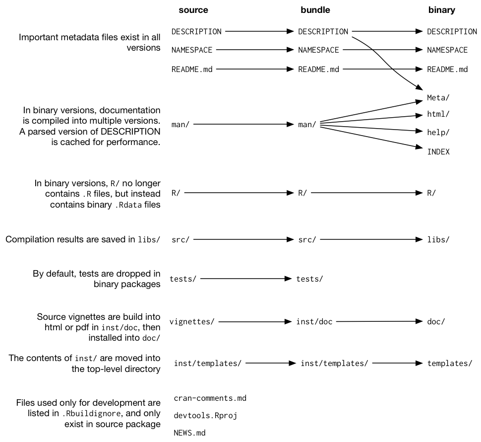
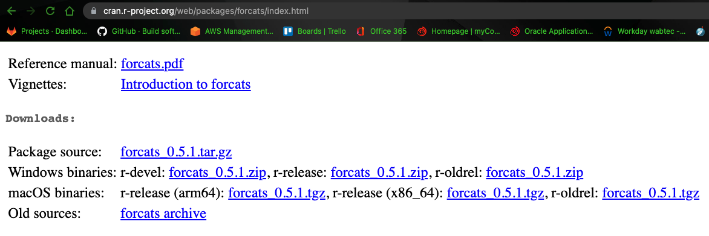
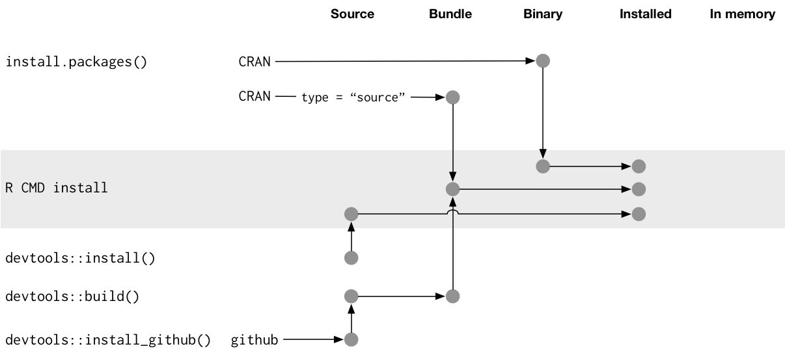

# Package structure and state

**Learning objectives:**

- Convert implicit knowledge into the explicit knowledge to create and modify R packages
- Learn about the various states a package
- Identify the difference between a package and library
- Understand the use of `.Rbuildignore`

## Package states

- When you create or modify a package, you work on its *source code* or *source files*
- You interact with the in-development package in its **source** form

R Packages can be in five different states:

- source: Raw form, editable
- bundled: Compressed to a single archive file (.tar)
- binary: Compiled, OS Specific (Windows or Mac). It is implied Linux already has the ability to compile if required.
- installed: Decompressed into a package library
- in-memory: Explicitly referenced for use

Function calls like `install.packages()` and `devtools::install_github()` move a package from source, bundled, or binary states into the installed state. Functions like `library()` bring your package into memory for immediate use.

## Source package

- A **source** package is just a directory of files with a specific structure
- **Source** package contains a `DESCRIPTION` file, and `R` directory containing `.R` files, etc...

Some of our group have mentioned authoring or writing packages. Many, this is a new subject. Therefore you can view source files by first navigating to CRAN and by extension to its source repository. (Please correct me if my terminology is incorrect).

Examples of CRAN landing page:

- [forcats](https://cran.r-project.org/package=forcats)
- [readxl](https://cran.r-project.org/package=readxl)

Examples of GitHub/GitLab (or equivelent) version storage:

- [forcats](https://github.com/tidyverse/forcats)
- [readxl](https://github.com/tidyverse/readxl)

> Note: Some maintainers fail to link their source repos. In this case, google is your friend!

Even if a package is not developed on a public platform, you can visit its source in the [unofficial, read-only mirror maintained by R-hub](https://docs.r-hub.io/#cranatgh). 

Examples:

- [MASS](https://github.com/cran/MASS)
- [car](https://github.com/cran/car)

> Note: This mirror is not the same as exploring the package’s true development venue, because this source and its evolution is just reverse-engineered from the package’s CRAN releases.

## Bundled package

- A **bundled** package is a package that’s been compressed into a single file
- By extension of Linux, **source tarballs** or `tar.gz` files
  - Implying, source files and directories have been archived using the tar utility
    - `.tar` stands for **T**ape **Ar**chive
    - creates one file out of many files (with some compression)
  - The files are fully compressed using `gzip` or *GNU Zip*
    - gzip creates the `.gz` extension
- a **bundled** package is not source nor installed, but rather, an OS-agnostic storage medium

If you need to bundle a package your developing, use `devtools::build()`. 

*TLDR*: The `devtools::build()` calls `pkgbuild::build()` under the hood and ultimately `R CMD build`. For more information see [Building package tarballs](https://cran.r-project.org/doc/manuals/R-exts.html#Building-package-tarballs).

All CRAN packages are available in *bundled* form and can be downloaded from their CRAN landing page.

On Mac or Linux, run the following, from shell/terminal, to decompress and un-archive:

```{bash, UnTar, eval=FALSE}
tar xvf forcats_0.4.0.tar.gz
```

Quick explanation, you are calling on the `tar` utility. `-x` is *extract*, `-v` is *verbose* (show the output...makes you feel good to know something is happening), and `-f` is *filename*, uses the same filename as the archive.

Windows users, I'm sorry, you're going to have to use some type of utility like 7-Zip, WinZip, or WinRAR to decompress and un-archive. Windows does not have a native utility to accomplish this action. (Feel welcome to share your PowerShell examples if I'm incorrect).

> Note: A bit of research turns up, the `tar` utility was added to Windows 10, circa 2018. Earlier versions of Windows would require a third-party application.

```{r package-files, echo = FALSE, out.width = "100%", fig.cap = "Side-by-side comparison of source, bundled, and binary package."}

```

The main differences between a source package and an uncompressed bundle are:

- Vignettes have been built, so rendered outputs, such as HTML, appear below `inst/doc/` and a vignette index appears in the `build/` directory, usually alongside a PDF package manual.

- A local source package might contain temporary files used to save time during development, like compilation artifacts in `src/`. These are never found in a bundle.

- Any files listed in `.Rbuildignore` are not included in the bundle. These are typically files that facilitate your development process, but that should be excluded from the distributed product.

### .Rbuildignore
It is rare to contemplate the `.tar.gz` structure. However, it ***IS*** important to understand the `.Rbuildignore` file.

- `Rbuildignore` controls which files from the source package make it into the downstream forms
  - The concept is similar to other `.*ignore` files.
  - Exclude versus Include
- Each line of `.Rbuildignore` is a Perl-compatible regular expression
  - case insensitive
  - if the regex matches, the file is excluded
- You must **anchor** the regular expression
  - for example `^notes$` will exclude any filename string containing *notes*.
- a less specific (or more automated method) is to use `usethis::use_build_ignore("notes")`

`Rbuildignore` is a means to compromise your development environment with CRAN's requirements.

The affected files fall into two broad, semi-overlapping classes:

- Files that help you generate package contents programmatically. Examples:
  - Using README.Rmd to generate an informative and current README.md.
  - Storing .R scripts to create and update internal or exported data.
- Files that drive package development, checking, and documentation, outside of CRAN’s purview. Examples:
  - Files relating to the RStudio IDE.
  - Using the pkgdown package to generate a website.
  - Configuration files related to continuous integration/deployment and monitoring test coverage.
  
A non-exhaustive list of typical entries in the .Rbuildignore file

```{r, Non-Exhaustive list of .Rbuildignore entries, eval=FALSE}
^.*\.Rproj$         # Designates the directory as an RStudio Project
^\.Rproj\.user$     # Used by RStudio for temporary files
^README\.Rmd$       # An Rmd file used to generate README.md
^LICENSE\.md$       # Full text of the license
^cran-comments\.md$ # Comments for CRAN submission
^data-raw$          # Code used to create data included in the package
^pkgdown$           # Resources used for the package website
^_pkgdown\.yml$     # Configuration info for the package website
^\.github$          # Contributing guidelines, CoC, issue templates, etc.
```

> Note: The commmented text above should not be included in the `Rbuildignore` file and are only used for explination of each entry.

> Note: Remember that `usethis::use_build_ignore()` is an attractive way to manage this file.

## Binary package
 - Binary packages are used when a colleague doesn't have development tools installed
 - Uses a single file
 - Binary packages are OS-specific
  - Mac: `.tgz`
  - Windows: `.zip`
  - Linux: generally already have libraries capable of working with binary packages
 - To make a binary package use `devtools::build(binary=TRUE)`
  - Under the hood, calls `pkgbuild::build(binary=TRUE)` and ultimately `R CMD INSTALL --build`
  - For more information see [Building binary packages](https://cran.r-project.org/doc/manuals/R-exts.html#Building-binary-packages) section of [Writing R Extensions](https://cran.r-project.org/doc/manuals/R-exts.html)
  
> The primary maker and distributor of binary is CRAN, not individual maintainers.

 - Examples of downloading binary packages (image)
 
```{r, echo = FALSE, out.width = "100%", fig.cap = "Forcats CRAN Binary Download Options"}

```
 
 - Ironically, this download process is exactly what is happening when you call `install.packages()`
 - Decompressing a binary packages looks rather different from source or bundled package forms
    - Notible Differences:
      - There are no `.R` files in `R/` directory. Instead a more *efficient* form is used
      - `Meta/` directory contains a number or `.rds` files
      - Actual `help/` and `html/` are used instead of `man/`
      - If you had any code in `src/` directory, it will not be in `libs/`
        - Windows binary also contains `i386/` and `x64/` for 32 or 64 bit environments
      - Anything in `data/` is converted to more efficient forms
      - Contents of `inst/` are moved to top-level (for example vignette files are not in `doc/`)
      - Some files and folders have been dropped such as `README`, `build/`, `test/`, and `vignettes/`

```{bash, Tree output of Decompressed binary package, eval=FALSE}
.
├── DESCRIPTION
├── INDEX
├── LICENSE
├── Meta
│   ├── Rd.rds
│   ├── data.rds
│   ├── features.rds
│   ├── hsearch.rds
│   ├── links.rds
│   ├── nsInfo.rds
│   ├── package.rds
│   └── vignette.rds
├── NAMESPACE
├── NEWS.md
├── R
│   ├── forcats
│   ├── forcats.rdb
│   └── forcats.rdx
├── data
│   ├── Rdata.rdb
│   ├── Rdata.rds
│   └── Rdata.rdx
├── doc
│   ├── forcats.R
│   ├── forcats.Rmd
│   ├── forcats.html
│   └── index.html
├── help
│   ├── AnIndex
│   ├── aliases.rds
│   ├── figures
│   │   ├── README-ordered-plot-1.png
│   │   ├── README-unordered-plot-1.png
│   │   └── logo.png
│   ├── forcats.rdb
│   ├── forcats.rdx
│   └── paths.rds
└── html
    ├── 00Index.html
    └── R.css

7 directories, 33 files
```


## Installed package
- Installed package is a binary package that has been decompressed into a package library

> WARNING, COMPLICATED FIGURE AHEAD! LETS DISCUSS IT!

- In a perfect world, stringing together a set of simple steps: source -> bundle, bundle -> binary, binary -> installed
  - In the *REAL* world, it isn't as simple
  
```{r installation, echo = FALSE, out.width = "100%", fig.cap = "Many methods for converting between package states."}

```

The cool part of this process, and why this figure is important is, the `R CMD INSTALL` is the primary service for all forms of packaging. For more information check out [Installing packages section](https://cran.r-project.org/doc/manuals/R-admin.html#Installing-packages) of [Installing packages section](https://cran.r-project.org/doc/manuals/R-admin.html#Installing-packages).

- Devtools exposes a family of `install_*()` to address needs beyond only `install.packages()`. Again, more information can be found in [remotes package](https://remotes.r-lib.org/).


```{r, Library "Remotes", eval = TRUE}
library(remotes)

funs <- as.character(lsf.str("package:remotes"))
grep("^install_.+", funs, value = TRUE)
```

- `install_github()` is the flagship example of this remots library.
- using devtools/remotes `install_*()` functions aim at making things possible with base tooling a bit easier or more explicit
  - Example is `install_version()` which installs a specific version of a CRAN package
  
- `.Rinstignore` lets you keep files present in a package bundle out of the installed package. The use of `.Rinstignore` is rather obscure or rarely needed

> TODO: Revisit this section later with respect to pak https://pak.r-lib.org.

## In-memory package

Let's discuss `library(usethis)`.

```{r, UseThis in action, eval=FALSE}
library(usethis)

create_package("~/newpackage")
```

- `usethis` package has been loaded into memory and attached to the search path
  - Loading and Attaching packages is not important during writing scripts....***IT IS EXTREMELY IMPORTANT WHEN WRITING PACKAGES***
  - See [search path](https://r-pkgs.org/namespace.html#search-path) for more details
  
We will learn in section 5.4 "Test drive with `load_all()`" how `devtools::load_all()` accelerates development, allowing you to load a source package directly to memory.

## Package libraries
When calling `library(foo)`, R looks through the current libraries for an installed package *foo*, and if successful, makes it available.

>Definition: **Library**: is a directory containing installed packages.

>Definition: **Packages**: are functional instructions to process information.

- These terms are often misused and reinforced within our vernacular (language dictionary).

> We use the `library()` function to load a **package**.

- As package prospect R Package Developers, it is a good idea to set the distinction between **library** and **package** early

- To see `.libPaths()` on Windows, use the following function call:

```{r, Windows .libPaths() output, eval = FALSE}
.libPaths()

lapply(.libPaths(), list.dirs, recursive = FALSE, full.names = FALSE)
```

- To see `.libPaths() on macOS, use the following function call:

```{r, macOS .libPaths() output, eval = FALSE}
.libPaths()

lapply(.libPaths(), list.dirs, recursive = FALSE, full.names = FALSE)
```

> NOTE TO SELF...THESE ARE THE SAME CALLS

Considering the output, we view two things:

1. A user library
2. A system-level or global library

A user library is typical for a Windows installation, but an *opt-in* for Mac Users. Depending on your development environment the idea would mean, I can delete my user packages but maintain my base R installation. *(Lets discuss this for a moment)*.

If you’re on macOS and only see one library, there is no urgent need to change anything. But next time you upgrade R, consider creating a user-level library. By default, R looks for a user library found at the path stored in the environment variable `R_LIBS_USER`, which itself defaults to `~/Library/R/x.y/library`. When you install, `R x.y.z` and prior to installing any add-on packages, use `dir.create("~/Library/R/x.y/library")` to set up a user library. Now you will have the library setup seen above. Alternatively, you could setup a user library elsewhere and tell R about that by setting the `R_LIBS_USER` environment variable in `.Renviron`.

- In is implied you need to re-install user packages for a minor version of R. (3.5.0 to 3.6.0). You generally do not require this for a patch release (3.6.0 to 3.6.1).

>NOTE: The x.y.z reference previously can also be read as *major.minor.patch* and is common within software engineering.

- As we grow and become more sophisticated, our management of packages will become more intricate.

- Examples like `renv` and its predecessor `packrat()` automate the process of managing project-specific libraries
  - An example woudl be loading specific versions of an environment to test forward and backward compatibility
  - Reverse dependency checks are another example of managing the library search path
  
The main levers that control which libraries are active:

- Environment variables, like `R_LIBS` and `R_LIBS_USER`, which are consulted at startup
- Calling `.libPaths()` with one or more filepaths
- Executing small snippets of code with a temporarily altered library search path via `withr::with_libpaths()`
- Arguments to individual functions, like `install.packages(lib =)` and `library(lib.loc =)`.

>NOTE: `library()` should NEVER be used inside a package. There are other mechinisims for declaring dependencies. We'll discuss this more in chapter 13.

## Meeting Videos

### Cohort 1

`r knitr::include_url("https://www.youtube.com/embed/qXJOy8f9TCM")`

<details>
<summary> Meeting chat log </summary>

```
00:30:11	Isabella Velásquez:	RSPM: https://www.rstudio.com/products/package-manager/
00:30:16	Isabella Velásquez:	and it’s called PyPI!
01:04:57	Isabella Velásquez:	https://pypi.org/
01:15:53	collinberke:	Microsoft’s capture of R Packages: https://mran.microsoft.com/documents/rro/reproducibility
```
</details>
