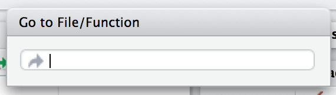
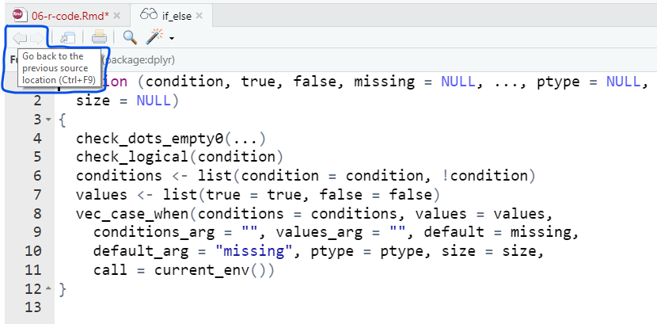
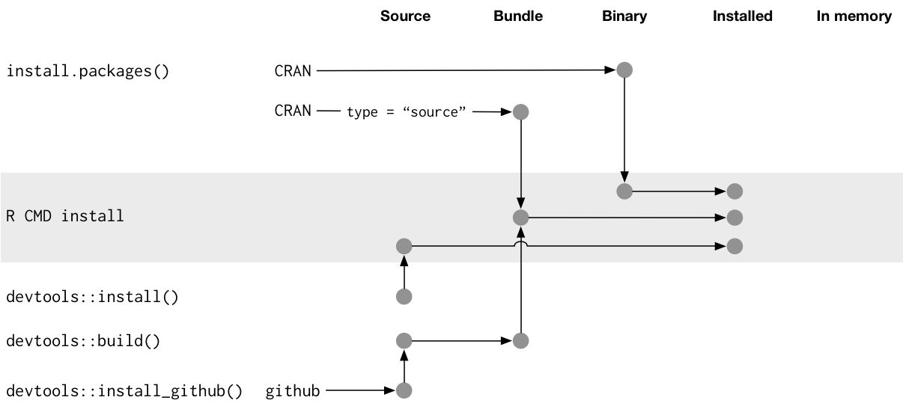
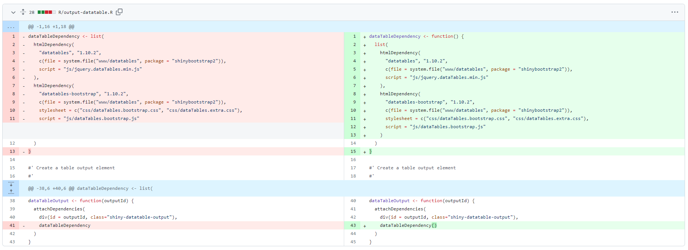

# (PART) Package components {-}

# R code

**Learning objectives:**

- **Organize functions** into files.
- Maintain a **consistent coding style**.
- Recognize the **requirements for functions** in a package.
- Compare and contrast **functions in a package** versus **functions in a script.**
- Use the fundamental workflows for **test-driving** and formally **checking** an in-development package.

## Mandatory conventions to organise functions

- Function definitions must be in `.R` files in the `R/` directory.

## Optional conventions to organise functions

- **File names should be meaningful** and convey which functions are defined within
- Avoid having:
  - One file per function
  - All functions in the same file
- A single .R file can have:
  - A **main function** and its supporting helpers like the [tidyr::separate](https://github.com/tidyverse/tidyr/blob/v1.1.2/R/separate.R) function
  - A **family of related functions** like the [tidyr::hoist and tidyr::unnest](https://github.com/tidyverse/tidyr/blob/v1.1.2/R/rectangle.R) functions
  - A **very large function** with lots of documentation like the [tidyr::uncount](https://github.com/tidyverse/tidyr/blob/v1.1.2/R/uncount.R) function.
- For **small helper functions** used in functions across different files are typically stored in `R/utils.R` by convention (e.g [spotifyr/R/utils.R](https://github.com/charlie86/spotifyr/blob/master/R/utils.R))

> **If its hard to predict in which file a function lives**, it's time to separate your functions into more files.

## Rstudio ways to jump to a function

1. `Ctrl + .`



2. With your *cursor in a function* name press `F2`.

3. Ctrl + `click over function name`.

> You can return to your original file by clicking over the back arrow.



## Fast feedback via `load_all()`

Reminder to use `devtools::load_all()` to try out the functions in file under `R/` as it provides an excellent approximation to the namespace regime of an installed package.

## Code style

- What and why: [the tidyverse style guide](https://style.tidyverse.org/)
- How: [the `{styler}` package](https://styler.r-lib.org/)
  - `styler::style_pkg()` restyles an entire R package.
  - `styler::style_dir()` restyles all files in a directory.
  - `usethis::use_tidy_style()` is wrapper that applies one of the above functions depending on whether the current project is an R package or not.
  - `styler::style_file()` restyles a single file.
  - `styler::style_text()` restyles a character vector.
  
> Make sure you are using **version control system** before using any of this functions.


## Understanding when code is executed

When the **binary package is built** (often, by CRAN) all the code in `R/` is executed and the **results are saved**. 



Later cached results are re-loaded and made available for use by loading the package with `library()` function.

> Play special attention to any **R code outside of a function**.


## Aliasing a function recomendation

|**Code**|**Result**|
|:-------|:---------|
|`foo <- pkgB::blah`|It will fix the definition of `pkgB::blah()` at the version present on the machine where the binary package is built. <br> <br> But if a bug is discovered in `pkgB::blah()` and subsequently fixed, the package will still use the older, buggy version, until your package is rebuilt and your users upgrade, which is completely out of your control.|
|`foo <- function(...) pkgB::blah(...)`|With this little change now if an user calls `foo()`, the package will work the `pkgB::blah()` function at the version installed on the user's machine at that very moment.|

## Dynamic file path 

The prior code used to fail on user's machine as `system.file()` was called at **build-time** and the **result stored in the variable dataTableDependency** and saved in the binary package.

And when someone installs the binary package on their machine, **the path isn't updated to their path**.

If, on the other hand, htmlDependency() is called from a function at run-time, everything will work fine.



## Respect the R landscape

As people will use your package in many situations you should avoid editing the global settings, so we should avoid applying any of the functions in `R/`:

- Loading a package with `library()` or `require()`.
- Loading code with `source()`.
- Changing a global option with `options()`.
- Modifying the working directory with `setwd()`.
- Specifying seeds for creating random numbers with `set.seed()`. 
- Setting graphical parameters with `par()`.
- Setting environment variable with `Sys.setenv()`.
- Setting aspects of the locale with `Sys.setlocale()`.

> If you must use them, make sure to **clean up** after yourself.


## Sorting strings can be dangerous

As they depend on the **system locale**.

```
x <- c("bernard", "bérénice", "béatrice", "boris")

withr::with_locale(c(LC_COLLATE = "fr_FR"), sort(x))
#> [1] "béatrice" "bérénice" "bernard"  "boris"
withr::with_locale(c(LC_COLLATE = "C"), sort(x))
#> [1] "bernard"  "boris"    "béatrice" "bérénice"
```

> **Avoid relying on the user’s landscape**


## Restore state with `base::on.exit()`

`on.exit` records the expression given as its argument as needing to be **executed when the current function exits even when exiting due to an error**.

It is really useful for functions like `options()` and `par()` as they return the old value when you provide a new value.

```r
pi
#> [1] 3.141593

neat <- function(x, sig_digits) {
  op <- options(digits = sig_digits)
  on.exit(options(op), add = TRUE)
  
  print(x)
}

neat(pi, 2)
#> [1] 3.1

pi
#> [1] 3.141593
```

## Restore state with `withr::defer()`

`withr::defer()` is basically a drop-in substitute for on.exit().

```r
pi
#> [1] 3.141593

neater <- function(x, sig_digits) {
  op <- options(digits = sig_digits)
  defer(options(op))
  print(x)
}

neater(pi, 2)
#> [1] 3.1

pi
#> [1] 3.141593
```

## `base::on.exit()` vs `withr::defer()`

`base::on.exit()` **overwrites** the deferred actions registered in the previous call.

```r
on_exit_last_one_wins <- function() {
  cat("put on socks\n")
  on.exit(cat("take off socks\n"))
  
  cat("put on shoes\n")
  on.exit(cat("take off shoes\n"))
}

on_exit_last_one_wins()
#> put on socks
#> put on shoes
#> take off shoes
```

## `base::on.exit()` vs `withr::defer()`

`withr::defer()` **adds** expressions to the top of the stack of deferred actions.

```r
defer_stack <- function() {
  cat("put on socks\n")
  defer(cat("take off socks\n"))
  
  cat("put on shoes\n")
  defer(cat("take off shoes\n"))
}
defer_stack()
#> put on socks
#> put on shoes
#> take off shoes
#> take off socks
```

## `base::on.exit()` vs `withr::defer()`

To get such behavior with `on.exit()`, remember to call it with `add = TRUE, after = FALSE`.

```r
on_exit_stack <- function() {
  cat("put on socks\n")
  on.exit(cat("take off socks\n"), add = TRUE, after = FALSE)
  
  cat("put on shoes\n")
  on.exit(cat("take off shoes\n"), add = TRUE, after = FALSE)
}
on_exit_stack()
#> put on socks
#> put on shoes
#> take off shoes
#> take off socks
```

## `base::on.exit()` vs `withr::defer()`

`withr::defer()` can control over the environment the deferred events are associated with.

```r
local_digits <- function(sig_digits, envir = parent.frame()) {
  op <- options(digits = sig_digits)
  defer(options(op), envir = envir)
}

neatful <- function(x) {
  local_digits(1)
  print(x)
  local_digits(3)
  print(x)
  local_digits(5)
  print(x)
}

neatful(pi)
#> [1] 3
#> [1] 3.14
#> [1] 3.1416

pi
#> [1] 3.141593
```

## `withr` pre-made helpers

- `local_*()` functions are best for modifying state “from now until the function exits”

```r
neat_local <- function(x, sig_digits) {
  withr::local_options(list(digits = sig_digits))
  print(x)
  # imagine lots of code here
}
```

- `with_*()` functions are best for executing a small snippet of code with a modified state and **minimize the footprint of your state modifications**.

```r
neat_with <- function(x, sig_digits) {
  # imagine lots of code here
  withr::with_options(
    list(digits = sig_digits),
    print(x)
  )
  # ... and a lot more code here
}
```

## `withr` pre-made helpers

|**Do / undo this**|**withr functions**|
|:-----------------|:------------------|
|Set an R option|`local_options()`, `with_options()`|
|Set an environment variable|`local_envvar()`, `with_envvar()`|
|Change working directory|`local_dir()`, `with_dir()`|
|Set a graphics parameter|`local_par()`, `with_par()`|


## `withr::defer()`can defer events on the global environment

Deferred events can be set on the **global environment** *to facilitate the interactive development of code that is intended to be executed inside a function or test*. 

A message alerts the user to the fact that an explicit `deferred_run()` is the only way to trigger these deferred events.

```r
defer(print("hi"))
#> Setting deferred event(s) on global environment.
#>   * Execute (and clear) with `withr::deferred_run()`.
#>   * Clear (without executing) with `withr::deferred_clear()`.

pi
#> [1] 3.141593

# this adds another deferred event, but does not re-message
local_digits(3)

pi
#> [1] 3.14

deferred_run()
#> [1] "hi"

pi
#> [1] 3.141593
```

## When you do need side-effects

If your package talks to an **external system** you might need to do some initial setup when the package loads with `.onLoad()` or `.onAttach()` conventionally stored in `R/zzz.R`.

Some common uses of `.onLoad()` and `.onAttach()` are:

- To set custom options for your package with `options()`.

```r
.onLoad <- function(libname, pkgname) {
  op <- options()
  op.dplyr <- list(
    dplyr.show_progress = TRUE
  )
  toset <- !(names(op.dplyr) %in% names(op))
  if (any(toset)) options(op.dplyr[toset])

  invisible()
}
```

- To display an informative message when the package is attached.

```
.onAttach <- function(libname, pkgname) {
  packageStartupMessage("Welcome to my package")
}
```

- Use `.onUnload()` to to clean up side effects. 


## Constant health checks

Here is a typical sequence of calls when using devtools for package development:

1. Edit one or more files below `R/`.
2. `document()` (if you’ve made any changes that impact help files or NAMESPACE)
3. `load_all()`
4. Run some examples interactively.
5. `test()` (or `test_file()`)
6. `check()`


## CRAN notes

If you are submitting to CRAN, you must use only **ASCII characters** in your `.R` files:

  - 0-9
  - a-z
  - A-Z
  - Common punctuation
  - Unicode escape like `"\u1234"`. The function `stringi::stri_escape_unicode()` can be useful.
  
The functions `tools::showNonASCII()` and `tools::showNonASCIIfile(file)` help you find the offending file(s) and line(s).

```r
tools::showNonASCIIfile("R/foo.R")
#> 666: #' If you<e2><80><99>ve copy/pasted quotes, watch out!
```


## Meeting Videos

### Cohort 1

`r knitr::include_url("https://www.youtube.com/embed/BN0mBuuLKz8")`


### Cohort 2

`r knitr::include_url("https://www.youtube.com/embed/--GzGdfhCsI")`


### Cohort 3

`r knitr::include_url("https://www.youtube.com/embed/aotxnpmbLgQ")`


### Cohort 4

`r knitr::include_url("https://www.youtube.com/embed/E6Mvas6V-4E")`

<details>
<summary> Meeting chat log </summary>

```
00:24:12	Olivier Leroy:	for linux user (ubunutu) now we have r2u (https://eddelbuettel.github.io/r2u/) so it could be the same than windows /mac
00:36:58	Jamie Hogg:	Does anyone know why it is the zzz file?
00:37:03	Howard Baek:	^
00:37:08	Howard Baek:	why is it named "zzz"?
00:37:31	Jamie Hogg:	Is it to make it be 'built' last?
00:38:03	Howard Baek:	https://stackoverflow.com/questions/21448904/r-packages-what-is-the-file-zzz-r-used-for
00:38:12	Howard Baek:	"zzz" is just a conventional name
00:38:21	Jamie Hogg:	fair enough hahah
00:39:21	Howard Baek:	maybe it has sth to do with “build order”? because they use the last letter in the alphabet
00:39:42	Jamie Hogg:	Yeah, I was just going to say that :)
00:40:14	Howard Baek:	Ben Bolker confirms this in that SO post
00:40:23	Schafer, Toryn:	Maybe a question for Jenny?
00:41:12	Schafer, Toryn:	exams
00:42:01	Olivier Leroy:	https://www.r-exams.org/
00:42:04	Olivier Leroy:	?
00:43:37	Schafer, Toryn:	https://www.r-exams.org/intro/written/
00:47:28	Olivier Leroy:	https://github.com/rsbivand/rgrass/blame/main/R/initGRASS.R
00:49:00	Jamie Hogg:	I have to go now. Thanks for presenting today Sofi :)
00:50:53	Schafer, Toryn:	https://github.com/haoxuanwu/dspCP
01:06:25	Neil Birrell:	Here's a blog on the history of the assignment operator in R
01:06:26	Neil Birrell:	https://colinfay.me/r-assignment/
```
</details>
