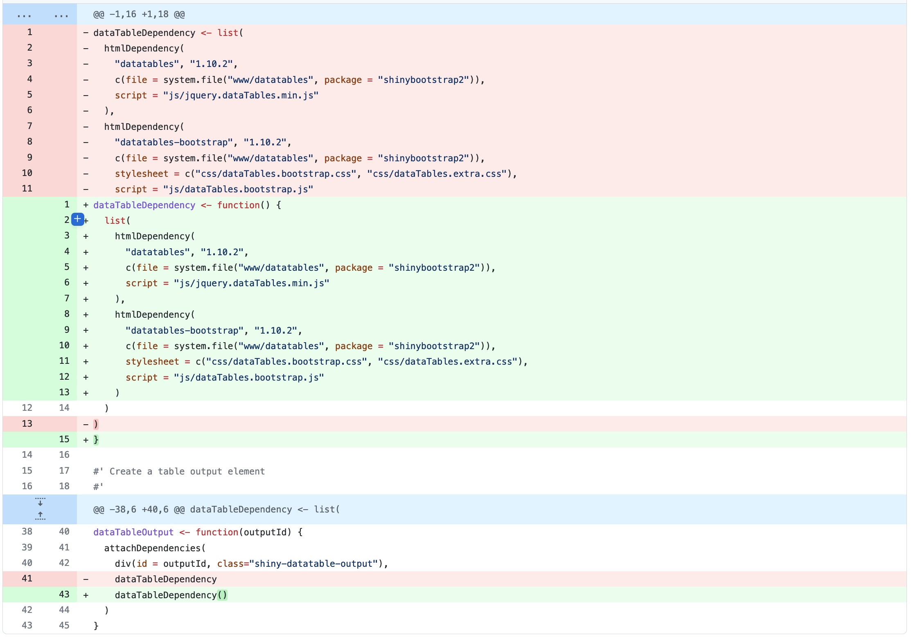

# (PART) Package components {-}

# R code

**Learning objectives:**

- **Organize functions** into files.
- Maintain a **consistent coding style.**
- Compare and contrast **functions in a package** versus **functions in a script.**
- Use the fundamental workflows for **test-driving** and formally **checking** an in-development package.

## Organise functions into files

### Only one hard rule

- Function definitions must be in `.R` files in the `R/` directory.

### Conventions

- File names should be meaningful and convey which functions are defined within
- The two extremes are bad:
  - One file per function
  - All functions in the same file
- Group functions into files
  - One function in one file if the function is very large, with lots of documentation
  - Main function and supporting function in one file (e.g. [tidyr/R/separate](https://github.com/tidyverse/tidyr/blob/v1.1.2/R/separate.R))
  - A family of related functions in one file (e.g. [tidyr/R/rectangle.R](https://github.com/tidyverse/tidyr/blob/v1.1.2/R/rectangle.R))
  - One function in one file if the function doesn't neatly fit any other grouping (e.g [tidyr/R/uncount.R](https://github.com/tidyverse/tidyr/blob/v1.1.2/R/uncount.R)) 
  - Small helper functions used in functions across different files are typically stored in `R/utils.R` by convention (e.g [spotifyr/R/utils.R](https://github.com/charlie86/spotifyr/blob/master/R/utils.R))
  - If its hard to predict in which file a function lives in, it's time to separate your functions into more files.

## Fast feedback via `load_all()`

Reminder to use `devtools::load_all()` to try out the functions in file under `/R`.

Compared to the alternatives (like using `source`), `load_all()` helps you to iterate more quickly and provides an excellent approximation to the namespace regime of an installed package.

## Code style

- What and why: [the tidyverse style guide](https://style.tidyverse.org/)
- How: [the `{styler}` package](https://styler.r-lib.org/)
  - `styler::style_pkg()` restyles an entire R package.
  - `styler::style_dir()` restyles all files in a directory.
  - `usethis::use_tidy_style()` is wrapper that applies one of the above functions depending on whether the current project is an R package or not.
  - `styler::style_file()` restyles a single file.
  - `styler::style_text()` restyles a character vector.


## Understanding when code is executed

### When code is executed in scripts vs. in packages

- Code in scripts, run interactively (in an IDE or with `source()`) or non-interactively with `Rscript`:
  - is run … when you run it(!)
- Code in a package: 
  - is run **when the package is built**
  


- Code in `/R` is executed and results are saved when the binary package is built (often, by CRAN) ("build time")
- The cached results are re-loaded and made available for use When you load a package with `library()` ("load time")

- This means that:
  - for macOS and Windows users of CRAN packages, build time is whenever CRAN built the binary package for their OS.
  - for those who install packages from source, build time is when they (built and) installed the package.
  
(Building of the package is what is accomplished by `R CMD INSTALL --build`, not `R CMD build`, which makes a bundled package, i.e. a "source tarball").

### Real world example: `Sys.time()`

```
x <- Sys.time()
```

- In a script `x` tells you when the script was run. 
- In a package, `x` tells you when the package was built.

### Real world example: `system.file()`

The shinybootstrap2 package once had this code below `R/` which works fine when the package is built on the same machine as it is used on.

```
dataTableDependency <- list(
  htmlDependency(
    "datatables", "1.10.2",
    c(file = system.file("www/datatables", package = "shinybootstrap2")),
    script = "js/jquery.dataTables.min.js"
  ),
  htmlDependency(
    "datatables-bootstrap", "1.10.2",
    c(file = system.file("www/datatables", package = "shinybootstrap2")),
    stylesheet = c("css/dataTables.bootstrap.css", "css/dataTables.extra.css"),
    script = "js/dataTables.bootstrap.js"
  )
)
```

The solution is to call `system.file()` from a function, at run time.



### Real world example: Aliasing a function

#### Don't do this

```
foo <- pkgB::blah
```

#### Do this

```
foo <- function(...) pkgB::blah(...)
```
The first definition will cause foo() in your package to reflect the definition of pkgB::blah() at the version present on the machine where the binary package is built (often CRAN), at that moment in time.

The main take away from the examples is: **Any R code outside of a function is suspicious and should be carefully reviewed.**

## Respect the R landscape

- People will use your package in situations that you never imagined. 
- This means that you have to pay attention to the R landscape (i.e. not only available functions and objects, but all the global settings)

### Examples of actions that change the R landscape

- Loading a package with `library()` 
- Changing global options with `options()`
- Changing the working directory with `setwd()`

### How to know when you have changed the R landscape

- If the behavior of other functions differs before and after running your function, you have modified the landscape. 

### Tips to avoid changing the landscape with your functions

- Don't use `library()` or `require()`. Use the `DESCRIPTION` to specify your package's requirements.
- Never use `source()` to load from a file. 
- Non-exhaustive list of other functions that should be used with caution.
  - `options()`
  - `par()`
  - `setwd()`
  - `Sys.setenv()`
  - `set.seed()`
- Flip side of this is that you shouldn't rely on user's landscape. For example, functions that rely on sorting strings are dangerous, because sort order depends on the system locale.


### What if you have to use one of the above functions and alter the landscape?

- Make sure to clean up after yourself. 

#### Manage state with withr

- `withr::defer()` is inspired by `base::on.exit()`.
- The general pattern is:
  - to capture the original state
  - schedule its eventual restoration
  - then make the state change
- for example, below, where some setters like `options()` and `par()` return the old value when you provide a new one, allowing you to do something like this. 

```
f <- function(x, y, z) {
  ...
  old <- options(mfrow = c(2, 2), pty = "s")
  defer(options(old))
  ...
}
```

- `withr::defer()` can also be using in the global environment for developing code interactively, and cleaned up with `withr::deferred_clear()`. 

#### Restoring state with `base::on.exit()`

- Very similar to `withr::defer()`
- Note that we use the `add = TRUE` argument, which adds to the list of deferred cleanup tasks rather than replace them.

```
g <- function(a, b, c) {
  ...
  scratch_file <- tempfile()
  on.exit(unlink(scratch_file), add = TRUE)
  file.create(scratch_file)
  ...
}
```

#### Isolate side-effects

- Often you can't avoid creating side effects, e.g. printing output or creating plots
- Good practice is to isolate them in functions that only produce output.
- e.g. instead of combining them into one function, write two functions for data wrangling and plotting, respectively. 


#### When you do need side-effects

- Most common when your package talks to an external system
- You may need to:
  - Display a message when your package loads
  - Set custom options for your package with `options()`
- Use `.onLoad()` and `.onAttach()` (mostly the former)

```
.onAttach <- function(libname, pkgname) {
  packageStartupMessage("Welcome to my package")
}
```

- Use `.onUnload()` to to clean up side effects. 
- `.onLoad()` etc. are conventionally stored in `R/zzz.R`

## Constant health checks

Here is a typical sequence of calls when using devtools for package development:

1. Edit one or more files below `R/`.
2. `document()` (if you’ve made any changes that impact help files or NAMESPACE)
3. `load_all()`
4. Run some examples interactively.
5. `test()` (or `test_file()`)
6. `check()`


Experienced developers cycle through these steps several times in an hour or day (remember, fast feedback!). Lack of comfort with these steps often leads to a dysfunctional workflow that is run infrequently (maybe once per month) and makes it difficult to spot bugs as they arise. That dysfunctional workflow looks like:


1. Edit one or more files below `R/`.
2. Build, install, and use the package. Iterate occasionally with previous step.
3. Write documentation (once the code is “done”).
4. Write tests (once the code is “done”).
5. Run `R CMD check` right before submitting to CRAN or releasing in some other way.

The value of fast feedback also applies to running `document()`, `test()`, and `check()`. There are problem that can't be detected from using `load_all()` and running a few interactive examples. Finding and fixing bugs right after they were created is much easier than troubleshooting them weeks or months after you last touched the code.


## CRAN notes

- If you are submitting to CRAN, you must use only ASCII characters in your `.R` files. i.e. 0-9, a-Z, common punctuation
- If you need to use a Unicode character, you can specify it in the special unicode escape "\\u1234" format. 

```
x <- "This is a bullet •"
y <- "This is a bullet \u2022"
identical(x, y)
#> [1] TRUE
cat(stringi::stri_escape_unicode(x))
#> This is a bullet \u2022
```

## Meeting Videos

### Cohort 1

`r knitr::include_url("https://www.youtube.com/embed/BN0mBuuLKz8")`


### Cohort 2

`r knitr::include_url("https://www.youtube.com/embed/--GzGdfhCsI")`


### Cohort 3

`r knitr::include_url("https://www.youtube.com/embed/aotxnpmbLgQ")`


### Cohort 4

`r knitr::include_url("https://www.youtube.com/embed/E6Mvas6V-4E")`

<details>
<summary> Meeting chat log </summary>

```
00:24:12	Olivier Leroy:	for linux user (ubunutu) now we have r2u (https://eddelbuettel.github.io/r2u/) so it could be the same than windows /mac
00:36:58	Jamie Hogg:	Does anyone know why it is the zzz file?
00:37:03	Howard Baek:	^
00:37:08	Howard Baek:	why is it named "zzz"?
00:37:31	Jamie Hogg:	Is it to make it be 'built' last?
00:38:03	Howard Baek:	https://stackoverflow.com/questions/21448904/r-packages-what-is-the-file-zzz-r-used-for
00:38:12	Howard Baek:	"zzz" is just a conventional name
00:38:21	Jamie Hogg:	fair enough hahah
00:39:21	Howard Baek:	maybe it has sth to do with “build order”? because they use the last letter in the alphabet
00:39:42	Jamie Hogg:	Yeah, I was just going to say that :)
00:40:14	Howard Baek:	Ben Bolker confirms this in that SO post
00:40:23	Schafer, Toryn:	Maybe a question for Jenny?
00:41:12	Schafer, Toryn:	exams
00:42:01	Olivier Leroy:	https://www.r-exams.org/
00:42:04	Olivier Leroy:	?
00:43:37	Schafer, Toryn:	https://www.r-exams.org/intro/written/
00:47:28	Olivier Leroy:	https://github.com/rsbivand/rgrass/blame/main/R/initGRASS.R
00:49:00	Jamie Hogg:	I have to go now. Thanks for presenting today Sofi :)
00:50:53	Schafer, Toryn:	https://github.com/haoxuanwu/dspCP
01:06:25	Neil Birrell:	Here's a blog on the history of the assignment operator in R
01:06:26	Neil Birrell:	https://colinfay.me/r-assignment/
```
</details>
