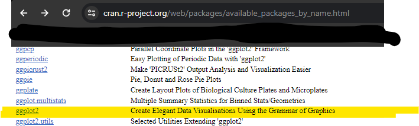
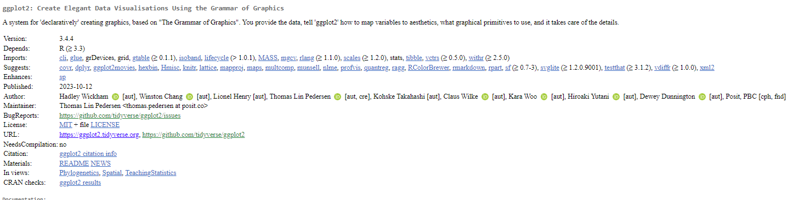

# (PART) Package metadata {-}

# DESCRIPTION

**Learning objectives:**

  - Understand the `DESCRIPTION` file and the most important package metadata
  - Declare dependencies with `Imports`, `Suggests`, `Depends`, `LinkingTo`, and `Enhances` fields
  - Add `Title`, `Description`, `Authors`
  - Preview `License`, `Version`

## `DESCRIPTION` File {-}

- `DESCRIPTION` file stores important metadata about a package.
  - Required pkgs, what pkg does, maintainer contact info, etc
- Every package has `DESCRIPTION`; anything with `DESCRIPTION` is a package 
- `usethis::create_package("mypackage")` adds `DESCRIPTION` file
- Set `DESCRIPTION` defaults as named list in `usethis.description` (see [usethis setup](https://usethis.r-lib.org/articles/usethis-setup.html))
- `DESCRIPTION` file format = DCF (Debian Control Format)
  - Each line is a field name & value sep by `:`
  - If a value has multiple lines indent following lines 4 spaces. 
- [{desc}](https://desc.r-lib.org/) can help with `DESCRIPTION`s programmatically. 
  

## Example `DESCRIPTION` File {-}

```
Package: mypackage
Title: What the Package Does (One Line, Title Case)
Version: 0.0.0.9000
Authors@R: 
    person("First", "Last", , "first.last@example.com", role = c("aut", "cre"),
           comment = c(ORCID = "YOUR-ORCID-ID"))
Description: The description of a package is usually long,
    spanning multiple lines. The second and subsequent lines
    should be indented, usually with four spaces.
License: `use_mit_license()`, `use_gpl3_license()` or friends to pick a
    license
Encoding: UTF-8
Roxygen: list(markdown = TRUE)
RoxygenNote: 7.2.0
```

## Title {-}

`Title` = 1-line description of the package

- Plain text
- Title Case
- Does not end in a period
- Shows on CRAN download page & `Packages` tab in RStudio
- Keep it short (ideally < 65 characters)
- Do not include package name
- Put the names of R packages, software, and APIs inside 'single quotes'
- Do not start with "A package for..." or "This package does...".
 
## Description {-}

`Description` can be up to a paragraph

- Each line up to 80 characters
- Indent subsequent lines with 4 spaces
- Put the names of R packages, software, and APIs inside 'single quotes'
- Can use acronyms here
- If you want more detailed info, add it to `README.md`

## Title & Description Example {-}

```
Title: Create Elegant Data Visualisations Using the Grammar of Graphics
Description: A system for 'declaratively' creating graphics,
    based on "The Grammar of Graphics". You provide the data, tell 'ggplot2'
    how to map variables to aesthetics, what graphical primitives to use,
    and it takes care of the details.
```

## On CRAN {-}





## Author: who are you? {-}

- Use the `Authors@R` field 
- Contains executable R code `utils::person()`
- Fields are used to generate citation for package
- Use email that you will have access for a while.

```
person(given = NULL, family = NULL, middle = NULL,
       email = NULL, role = NULL, comment = NULL,
       first = NULL, last = NULL)
```

## Authors@R in Practice {-}

```
Authors@R: person("Hadley", "Wickham", email = "hadley@rstudio.com",
  role = c("aut", "cre"), comment = c(ORCID = "0000-0001-1234-5678"))
```

- Name (given, family)
- Email address
- Role: Every packages needs at least one author (aut) and one maintainer (cre)
  - **`cre`: current maintainer**
  - **`aut`: authors who have made significant contributions**
  - `ctb`: made smaller contributions
  - `cph`: copyright holder if someone other than author
  - `fnd`: funder
- Comment
  - Can use this to add ORCID

## Multiple authors {-}

List multiple authors with `c()`:

```
Authors@R: c(
    person("Hadley", "Wickham", email = "hadley@rstudio.com", role = "cre"),
    person("Winston", "Chang", email = "winston@rstudio.com", role = "aut"),
    person("RStudio", role = c("cph", "fnd")))
```

## License {-}

- License field is mandatory
- If you want to share your package, include a license.
- You can use `usethis::use_*_license()` for configuration.
- More in Chapter 12!

## `Imports` & `Suggests` {-}

- `Imports` = packages users need at runtime; will be installed or updated when users install your package
- `Suggests` = packages needed for dev tasks or optional functionality (not required) 
- Both use comma-separated list of package names (ideally 1 pkg/line, alphabetical) 

## `usethis::use_package()` {-} 

- Can also indicate specific package version (`arrow (>= 14.0.0)`)
  - User will be asked to update (if necessary) when they install your package
- What min version to indicate requires careful consideration! 

```{r, eval=FALSE}
# Default is 'Imports'
usethis::use_package('dplyr', min_version = "1.0.0")
# Use whatever you have installed as minimum 
usethis::use_package('ggplot2', 'Suggests', min_version = TRUE)
```

## `Depends` and `Linking to` {-}

- `Depends` = packages your package depends on (BUT you usually want `Imports`, not `Depends, why in Ch10)
- `Depends` also used to indicate a min version of R itself: `Depends: R (>= 4.0.0)`
  - **Main takeaway:** if you state minimum R version, have a reason & take reasonable measures to test your claim regularly
- `Linking to` indicates if your packages uses C or C++ code from another package. 
- `Enhances` = packages are 'enhanced' by your package
  - It's sometimes hard to define this so we recommend not to use it. 

## An R version gotcha {-}

- Before April 2018: `.rds` files used `version 2` serialization format
- Since April 2019: `.rds` files use `version 3` serialization format
- R < 3.5.0 (before April 2018) can't read `.rds` v3
- When `.rds` saved as v3, package depends on R >= 3.5.0

```
NB: this package now depends on R (>= 3.5.0)
  WARNING: Added dependency on R >= 3.5.0 because serialized objects in
  serialize/load version 3 cannot be read in older versions of R.
  File(s) containing such objects:
    'path/to/some_file.rds'
```

- If you want to support R < 3.5.0, be careful about `.rds` version

## Other fields {-}

-  `Version` where pkg is in lifecycle / how it's evolving (Ch21)
-  `LazyData: true` if pkg has data for users (won't need `data()`)
-  `Encoding: UTF-8` by default (most common) 
-  `Collate` controls the order in which R files are sourced
-  `VignetteBuilder` lists pkg your pkg needs as a vignette engine (Ch17) 
-  `SystemRequirements` dependencies external to R

```
SystemRequirements: C++17
SystemRequirements: GNU make
SystemRequirements: TensorFlow (https://www.tensorflow.org/
``` 

- Don't use `Date` field, will auto-populate on build 

## Custom fields {-}

Full list of `DESCRIPTION` options in the [Writing R Extensions](https://rstudio.github.io/r-manuals/r-exts/Creating-R-packages.html#the-description-file).

You can also created your own, but CRAN has constraints:

- Don't re-purpose official field names used by R
- Only English words
- Use `Config/` prefix or `Note` suffix
- `create_package()` writes to more fields related to the use of roxygen2 package for documentation (Ch16)

```
Roxygen: list(markdown = TRUE)
RoxygenNote: 7.2.1
```


## Meeting Videos {-}

### Cohort 1 {-}

`r knitr::include_url("https://www.youtube.com/embed/BN0mBuuLKz8")`

`r knitr::include_url("https://www.youtube.com/embed/C_H1oQZD7m8")`


### Cohort 2 {-}

`r knitr::include_url("https://www.youtube.com/embed/--GzGdfhCsI")`

`r knitr::include_url("https://www.youtube.com/embed/8PU_KT5IpWg")`


### Cohort 3 {-}

`r knitr::include_url("https://www.youtube.com/embed/vQSYeGwX9yQ")`

<details>
<summary> Meeting chat log </summary>

```
00:05:04	Isabella Velásquez:	https://twitter.com/thomas_mock/status/1526977676661112832
00:29:23	Ryan Metcalf:	I haven't found the directly answer for Maximum version of dependencies. However, the following thread is related (I'm only skimming at the moment). Adding to Arun's question. https://community.rstudio.com/t/determining-which-version-of-r-to-depend-on/4396/11
00:51:43	Arun Chavan:	MAJOR version when you make incompatible API changes,
    MINOR version when you add functionality in a backwards compatible manner, and
    PATCH version when you make backwards compatible bug fixes.
00:51:50	Arun Chavan:	from https://semver.org/
```
</details>


### Cohort 4 {-}

`r knitr::include_url("https://www.youtube.com/embed/Dohr28WYaX0")`
