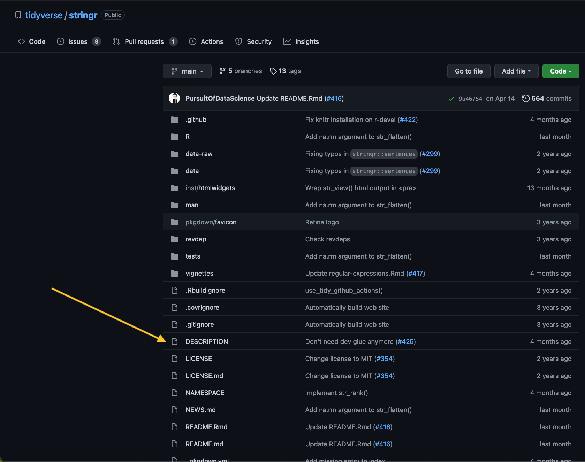
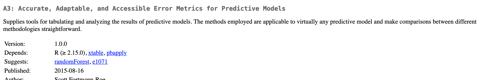
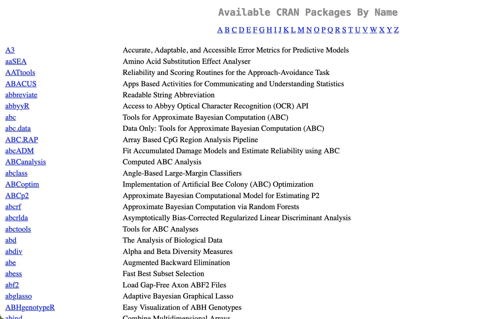

# (PART) Package metadata {-}

# DESCRIPTION

Note: These slides were written for an old version of this chapter, which incorporated NAMESPACE. The NAMESPACE section should likely be moved to chapter 11 and/or 12.

**Learning objectives:**

- Understand the `DESCRIPTION` file and the most important package metadata
  - Declare dependencies with `Imports`, `Suggests`, `Depends`, `LinkingTo`, and `Enhances` fields
- Add title, description, authors
- Preview license, version

## `DESCRIPTION` File

- Every package has a `DESCRIPTION` and if it has a `DESCRIPTION` file then it is a package 
- `usethis::create_package("mypackage")` adds a `DESCRIPTION` file
  - You can set a custom `DESCRIPTION` file with `usethis.description`
  

Example `DESCRIPTION` file:

```r
Package: mypackage
Title: What the Package Does (One Line, Title Case)
Version: 0.0.0.9000
Authors@R: 
    person("First", "Last", , "first.last@example.com", role = c("aut", "cre"),
           comment = c(ORCID = "YOUR-ORCID-ID"))
Description: The description of a package is usually long,
    spanning multiple lines. The second and subsequent lines
    should be indented, usually with four spaces.
License: `use_mit_license()`, `use_gpl3_license()` or friends to pick a
    license
Encoding: UTF-8
Roxygen: list(markdown = TRUE)
RoxygenNote: 7.2.0
```

## Title and description

What does your package do?



### Title

- `Title` is a one line description of the package
  - Plain text
  - Capitalized title
  - Does not end in a period
  - Shows up on CRAN download page
  - Do not include package name
  - Put the names of R packages, software, and APIs inside single quotes
  - Do not start with "A package for..." or "This package does...".
  
### Description

- `Description` can be up to a paragraph
  - Each line up to 80 characters
  - Indent subsequent lines with 4 spaces
  - Put the names of R packages, software, and APIs inside single quotes
  - You can use acronyms here
  
```
Title: Create Elegant Data Visualisations Using the Grammar of Graphics
Description: A system for 'declaratively' creating graphics,
    based on "The Grammar of Graphics". You provide the data, tell 'ggplot2'
    how to map variables to aesthetics, what graphical primitives to use,
    and it takes care of the details.
```

Shows up on CRAN like so:



## Author

Who are you?

- Contains executable R code `utils::person()`
- Fields are used to generate citation for package

```
person(given = NULL, family = NULL, middle = NULL,
       email = NULL, role = NULL, comment = NULL,
       first = NULL, last = NULL)
```

```
Authors@R: person("Hadley", "Wickham", email = "hadley@rstudio.com",
  role = c("aut", "cre"))
```

- Name (given, family)
- Email address
- Role:
  - `cre`: the current maintainer*
  - `aut`: authors who have made significant contributions*
  - `ctb`: contributors who have made smaller contributions
  - `cph`: copyright holder if someone other than author
  - `fnd`: funder
- Comment
  - Can use this to add ORCID
  
* need at least one

List multiple authors with `c()`:

```
Authors@R: c(
    person("Hadley", "Wickham", email = "hadley@rstudio.com", role = "cre"),
    person("Winston", "Chang", email = "winston@rstudio.com", role = "aut"),
    person("RStudio", role = c("cph", "fnd")))
```

## License

If you want to share your package, include a license.

You can use `usethis::use_*_license()` for configuration.

More in Chapter 9! -> now chapter 12 TODO see if the note from this session need to stay here or move to chapter 12

**Notes from session**

Jon:
Be sure to check the license of the source package. Fortunately that's the next chapter! You want to make sure it's a permissive license.
Still give credit to where you found it in your source code, regardless of how permissive the license might be. For example, I use %||% from {rlang} in a bunch of packages, and, if I'm not importing anything else from {rlang}, I just copy/paste the (very simple) definition and note that I copy/pasted it from {rlang}.

The thing Collin Berke showed is called re-exporting, and that's different from copy/pasting code. It is completely ok to re-export functions; it still requires the user to have the other package, and it explicitly gives credit to the other package. See usethis::use_pipe() for an example of that. usethis::use_tidy_eval() is another one.

Tan:
re-exporting also avoids some of the permissive licensing issues!

## Version

- Determines if dependencies are satisfied
- Two integers and separated by `.` or `-` (recommended to use `.`)
- Starts at `0.0.0.9000`
  - Based on Semantic Versioning and by the X.Org versioning schemes

Equivalent examples:
```
numeric_version("1.9") == numeric_version("1.9.0")
```

Can update version number by running `usethis::use_version()` or `usethis::use_dev_version()`.

## Other fields

### `URL` and `BugReports`

- The `URL` field is commonly used to advertise the package’s website and to link to a public source repository
- `BugReports` is the URL where bug reports should be submitted

`usethis::use_github()` will automatically create these for you; `usethis::use_github_links()` can add them for you.

### `Encoding`

- Required if DESCRIPTION does not consist entirely of ASCII character
- Default is `Encoding: UTF-8`

### `Collate`

- Controls the order in which files are sourced
  - Most common if you're using S4 (a system for object oriented programming)

### `LazyData`

- If true, data is lazy loaded so users don't have to run `data()`
- `usethis::use_data()` does this for you

### `Roxygen*`

`create_package()` creates fields related to the roxygen package

## NAMESPACE file

```
# Generated by roxygen2 (4.0.2): do not edit by hand
S3method(as.character,expectation)
S3method(compare,character)
export(auto_test)
export(auto_test_package)
export(colourise)
export(context)
exportClasses(ListReporter)
exportClasses(MinimalReporter)
importFrom(methods,setRefClass)
useDynLib(testthat,duplicate_)
useDynLib(testthat,reassign_function)
```

Each line contain a directive. 8 directives exist and can be divided in: 

- exported from this package:  
    * `export()`: export function  
    * `exportPattern()`: export all functions that match a pattern  
    * `exportClasses()`, `exportMethodsFrom()`: S4 classes and methods  
    * `S3method()`: S3 methods 

- imported from another package:  
    * `import()`: import **all** function from a package 
    * `importFrom()`: import select functions  
    * `importClassesFrom()`, `importMethodsFrom()`: import S4 Classes and methods
    
  
Better not to do it by "hand" but with {roxygen2} :

- Namespace definitions live next to the function: ie reading the function you know if it is imported or not

- one tag `@export` : generate the correct dirrective 

- {roxygen2} make NAMESPACE tidy: even if you do more than one `@importFrom foo bar` you only get one directive `importFrom(foo, bar)`

{roxygen2} vignette on how to do it: https://roxygen2.r-lib.org/articles/namespace.html
  
## Final notes

Full list of what can be in the `DESCRIPTION` file is in the [R extensions manual](https://cran.r-project.org/doc/manuals/R-exts.html#The-DESCRIPTION-file).

You can also created your own but CRAN does have constraints

- Only English words
- Use `Config/` prefix or `Note` suffix

## Meeting Videos

### Cohort 1

`r knitr::include_url("https://www.youtube.com/embed/BN0mBuuLKz8")`

`r knitr::include_url("https://www.youtube.com/embed/C_H1oQZD7m8")`


### Cohort 2

`r knitr::include_url("https://www.youtube.com/embed/--GzGdfhCsI")`

`r knitr::include_url("https://www.youtube.com/embed/8PU_KT5IpWg")`


### Cohort 3

`r knitr::include_url("https://www.youtube.com/embed/vQSYeGwX9yQ")`

<details>
<summary> Meeting chat log </summary>

```
00:05:04	Isabella Velásquez:	https://twitter.com/thomas_mock/status/1526977676661112832
00:29:23	Ryan Metcalf:	I haven't found the directly answer for Maximum version of dependencies. However, the following thread is related (I'm only skimming at the moment). Adding to Arun's question. https://community.rstudio.com/t/determining-which-version-of-r-to-depend-on/4396/11
00:51:43	Arun Chavan:	MAJOR version when you make incompatible API changes,
    MINOR version when you add functionality in a backwards compatible manner, and
    PATCH version when you make backwards compatible bug fixes.
00:51:50	Arun Chavan:	from https://semver.org/
```
</details>


### Cohort 4

`r knitr::include_url("https://www.youtube.com/embed/Dohr28WYaX0")`
