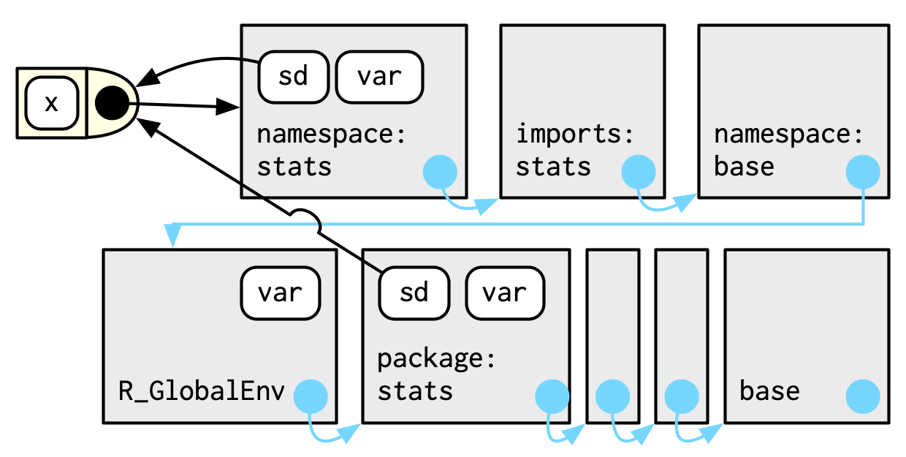

# Dependencies: Mindset and Background

One should not have an all or nothing mindset when it comes to dependencies. This chapter aims at how to find the balance.

**Learning objectives:**

- When should you take a dependency?  
- Deciding between Imports, Suggests, and Depends
- Namespace system and user's search path

This chapter should be revisited "as your packages get more ambitious and sophisticated."

## When should you take a dependency?

This section is adapted from a blog post and talk by Jim Hester. 

### Dependencies are not equal 

There is a cost associated with adding a dependency that make them not equal.

**How can dependencies differ in cost:**

1. Type: base and recommended packages vs. non-CRAN repository packages
2. Number of upstream dependencies: potentially large number of recursive dependencies
3. Already fulfilled dependencies: lower costs to recursive dependencies and highly downloaded packages
4. Install burden: compilation time, binary package size, system requirements
5. Maintenance capacity: will the package maintainers keep up?
6. Functionality: outsourcing broadly used functions saves you time

### Prefer a holistic, balanced, and quantitative approach

**Holistic**: Who is the primary audience?

- useRs will likely have more dependencies installed than other developeRs

**Balanced**: the trade-off of adding a dependency (install time, disk space, maintenance) comparted to removing a dependency (fewer features, more development by you)

**Quantitative**: use packages like itdepends and pak to quantify how "heavy" a dependency is

### Dependency thoughts specific to the tidyverse

- Never depend on tidyverse or devtools. Instead depend on the specific package that implements the desired functionality.
- tidyverse and devtools have large recursive dependencies ($\geq 100$)
- Free (low-level) tidy dependences include:
    + rlang
    + cli and glue
    + withr
    + lifecycle
- R CMD check throws a note for including more than 20 "non-default" package dependencies

### Whether to Import or Suggest

#### `Imports`

- **Must** be present at runtime
  - Automatically installs missing packages when your package is installed
  - `devtools::load_all()` checks too
  - Installed but not attached; to attach, use `package::function()` within package

```
Imports:
    dplyr,
    tidyr
```

#### `Suggests`

- Your package *can* use these packages, but doesn’t require them
  - "Isn’t terribly relevant for packages where the user base is approximately equal to the development team"
  - Does not automatically install missing packages when your package is installed
  - Add for development tasks or to unlock additional functionality (run tests, build vignettes / examples) or rarely needed packages or tricky packages

```r
Suggests:
    ggplot2,
    testthat
```

## Namespace

### Motivation

- Namespace provides context for looking up value of an object associated with a name. 
- Example: `::` operator:

```r
library(lubridate)    |  library(here)
library(here)         |  library(lubridate)

here() # here::here() |  here() # lubridate::here()
```

- Recommended to use `package::function()` for dependencies in code below `R/`
- Package namespace saves us from potential user redefinitions of functions

### The `NAMESPACE` file

Example:

    # Generated by roxygen2: do not edit by hand

    S3method(compare,character)
    S3method(print,testthat_results)
    export(compare)
    export(expect_equal)
    import(rlang)
    importFrom(brio,readLines)
    useDynLib(testthat, .registration = TRUE)

Each line contains a **directive**:

-   `export()`: export a function (including S3 and S4 generics).
-   `S3method()`: export an S3 method.
-   `importFrom()`: import selected object from another namespace (including S4 generics).
-   `import()`: import all objects from another package's namespace. package.
-   `useDynLib()`: registers routines from a DLL.

Each line is generated by roxygen2. This method is preferred because:

- Namespace tags are integrated into source code
- Only need to learn `@export` and roxygen2 figures out the specific directive
- Roxygen2 takes on the burden of writing `NAMESPACE` in a neat and tidy manner

## Search path

More motivation for namespace

### Function lookup for user code

Where does R look for an object?

1. The global environment.
2. The packages that have been attached in reverse order.
3. `Autoloads`.
4. The base environment.

Adding another package changes the search path, but fortunately this is not applicable to package code.

### Function lookup inside a package

Advanced section developed from Advanced R chapter on environments.

Two environments:

1. Package environment: external interface with parent determined by search path and exposes exported objects.
2. Namespace environment: internal interface including all objects in package.

Every namespace environment has the same ancestors:

- **imports** environment: controlled by `NAMESPACE` file
- base **namespace**: base environment bindings
- global environment



## Attaching versus loading 

If a package is installed,

- **Loading** makes a package available in memory, but not added to the search path
- **Attaching** put package in the search path

*Technically*, `library()` loads then attach the package.

Four functions make a package available:

|        | Throws error         | Returns `FALSE`                         |
|--------|----------------------|-----------------------------------------|
| Load   | `loadNamespace("x")` | `requireNamespace("x", quietly = TRUE)` |
| Attach | `library(x)`         | `require(x, quietly = TRUE)`            |

- `library()` great for data analysis or vignette
- Use `requireNamespace("x", quietly = TRUE)` to specify different behavior based on a package being installed
- Other two unlikely to be needed in generic situations

### Whether to Import or Depend

- `Imports`: package will be *loaded*
- `Depends`: package will be *attached*
- Favor `Imports` over `Depends` as `Depends` changes the global landscape

## Meeting Videos

### Cohort 1

`r knitr::include_url("https://www.youtube.com/embed/C_H1oQZD7m8")`


### Cohort 2

`r knitr::include_url("https://www.youtube.com/embed/8PU_KT5IpWg")`


### Cohort 3

`r knitr::include_url("https://www.youtube.com/embed/2-baO_E9p1s")`

<details>
<summary> Meeting chat log </summary>

```
00:05:44	Ryan Metcalf:	https://www.rstudio.com/conference/
00:08:38	Brendan Lam:	https://stackoverflow.com/questions/70097126/how-to-edit-namespace-with-roxygen2-when-creating-r-packages
00:08:51	Brendan Lam:	https://stackoverflow.com/questions/11990589/r-namespace-access-and-match-fun
00:44:59	Rex Parsons:	https://github.com/gentrywhite/DSSP/blob/b3d7f0d10374968a43a634a1ae3f65e9231fceb0/R/plot.R#L43
00:48:01	Rex Parsons:	https://stackoverflow.com/questions/5595512/what-is-the-difference-between-require-and-library
00:58:13	Rex Parsons:	gotta run guys - thanks Brendan and team!
00:58:29	collinberke:	https://stackoverflow.com/questions/64737686/why-library-or-require-should-not-be-used-in-a-r-package
```
</details>


### Cohort 4

`r knitr::include_url("https://www.youtube.com/embed/vlHK-D24wd0")`

<details>
<summary> Meeting chat log </summary>

```
00:31:39	Olivier Leroy:	https://stackoverflow.com/questions/13401977/what-does-the-autoloads-environment-do#13419964
00:31:57	Olivier Leroy:	apparently an envt that store function that could be called letter
00:32:28	Olivier Leroy:	latter*
00:32:55	Olivier Leroy:	Pointer maybe
00:54:34	Oluwafemi Oyedele:	I have to go now, thank you very much for the presentation @Toryn, I will catch up with the rest of the discussion, see you all next week!!!
```
</details>
