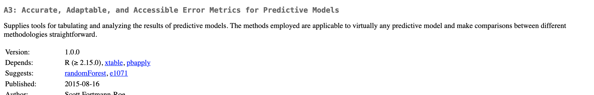
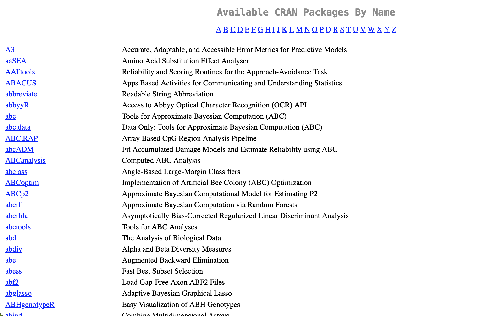

# DESCRIPTION and NAMESPACE

**Learning objectives:**

- Understand the `DESCRIPTION` file and the most important package metadata
  - Declare dependencies with `Imports`, `Suggests`, `Depends`, `LinkingTo`, and `Enhances` fields
- Add title, description, authors
- Preview license, version

## `DESCRIPTION` File

- Every package has a `DESCRIPTION` and if it has a `DESCRIPTION` file then it is a package 
- `usethis::create_package("mypackage")` adds a `DESCRIPTION` file
  - You can set a custom `DESCRIPTION` file with `usethis.description`
  

Example `DESCRIPTION` file:

```r
Package: mypackage
Title: What the Package Does (One Line, Title Case)
Version: 0.0.0.9000
Authors@R: 
    person("First", "Last", , "first.last@example.com", role = c("aut", "cre"),
           comment = c(ORCID = "YOUR-ORCID-ID"))
Description: The description of a package is usually long,
    spanning multiple lines. The second and subsequent lines
    should be indented, usually with four spaces.
License: `use_mit_license()`, `use_gpl3_license()` or friends to pick a
    license
Encoding: UTF-8
Roxygen: list(markdown = TRUE)
RoxygenNote: 7.2.0
```

## Dependencies

The `DESCRIPTION` file lists the packages that your package needs to work.

### `Imports`

- **Must** be present at runtime
  - Automatically installs missing packages when your package is installed
  - `devtools::load_all()` checks too
  - Installed but not attached; to attach, use `package::function()` within package

```
Imports:
    dplyr,
    tidyr
```

### `Suggests`

- Your package *can* use these packages, but doesn’t require them
  - "Isn’t terribly relevant for packages where the user base is approximately equal to the development team"
  - Does not automatically install missing packages when your package is installed
  - Add for development tasks or to unlock additional functionality (run tests, build vignettes / examples) or rarely needed packages or tricky packages

```r
Suggests:
    ggplot2,
    testthat
```

#### Guarding use of suggested packages

Or, how to write functions in your package with suggested packages in a way that won't cause issues for your users

- Use `requireNamespace("pkg", quietly = TRUE)`, which tries to load "pkg". If a package isn’t installed, loading will fail with an error
- rlang has some functions to do the below with other handy features

1) Stop function if it cannot load the package and send a message to install package

```
# the suggested package is required 
my_fun <- function(a, b) {
  if (!requireNamespace("pkg", quietly = TRUE)) {
    stop(
      "Package \"pkg\" must be installed to use this function.",
      call. = FALSE
    )
  }
  # code that includes calls such as pkg::f()
}
```

2) Escape part that needs the package and do something else
  - If package is installed, then package will be loaded and run `pkg::f()`
  - If it is not installed, it will fail to load, escape first part of if-else statement, and run `g()`
  
```
# the suggested package is optional; a fallback method is available
my_fun <- function(a, b) {
  if (requireNamespace("pkg", quietly = TRUE)) {
    pkg::f()
  } else {
    g()
  }
}
```

**About `requireNamespace()`**

Can also use `require()` for examples

- From Chapter 13: `require()` loads and attaches; `requireNamespace()` just loads
- `requireNamespace()` will fail if package is not installed; use it if that is when you want your script to fail; use `require()` want to use the package for something
- An example is basically the only place where we would use `require()` inside a package
  - [Pretty good Reddit thread](https://www.reddit.com/r/rstats/comments/5qtib2/what_is_the_difference_between_require_and/)
  
**Tests**

In tests, it is not as necessary to guard the use of a suggested package

- The tidyverse team assumes the package is available
- They should be caught by `R CMD check`

But if you really want to guard the use of them in a test, you can use `testthat::skip_if_not_installed()`. In the case below, it is because installing sf can be difficult and skipping this test allows the user to run the other tests.

```r
test_that("basic plot builds without error", {
  skip_if_not_installed("sf")

  nc_tiny_coords <- matrix(
    c(-81.473, -81.741, -81.67, -81.345, -81.266, -81.24, -81.473,
      36.234, 36.392, 36.59, 36.573, 36.437, 36.365, 36.234),
    ncol = 2
  )

  nc <- sf::st_as_sf(
    data_frame(
      NAME = "ashe",
      geometry = sf::st_sfc(sf::st_polygon(list(nc_tiny_coords)), crs = 4326)
    )
  )

  expect_doppelganger("sf-polygons", ggplot(nc) + geom_sf() + coord_sf())
})
```

### `Depends`

Use `Depends`, `LinkingTo`, and `Enhances` for more specialized dependencies.

- Do not use for packages, use `Imports` instead (Chapter 13 spoiler: `Depends` loads and attaches the package whereas `Imports` just loads it)
- Can be used to set a minimum version of R: `R (>= 4.0.0)`
  - If you state a minimum of R, you should have a reason and you should take reasonable measures to test your claim regularly
  
**An R version gotcha**

* `saveRDS()` used version 2 for twenty years
* Version 3 became the default in 2019 with R 3.6.0
* Older packages with version 2 `.rds` files were rebuilt with version 3 and  require R version 3.5.0 or above
* Bundled and source package different!
* All packages listing the original package in `Imports` or even `Suggests` inherit new dependency
* The more dependencies, the more thought to minimum versions

### `LinkingTo`

- Packages listed here rely on C or C++ code in another package

### `Enhances`

- Provide methods for classes defined in another package
- Not recommended

### `Remotes`

- Installs dependencies from outside of CRAN or Bioconductor
  - Nonstandard dependencies are not allowed in CRAN submissions
- Written similar to `Imports`

```
Remotes: hadley/testthat
```

### `Config/Needs/`

- Usually associated with continuous integration workflows (e.g., to build a website)
  - New edition will cover this more fully
- Ignored by CRAN
- Specialized task dependencies vs true runtime dependencies

### How to write fields

- Comma-separated
- One package per line
- Alphabetical
- Add with `usethis::use_package(package, type = "Imports")` & `usethis::use_package(package, type = "Suggests")`
- Use `usethis::use_tidy_description()` to put fields in standard order and alphabetize dependencies
- Write minimum versions in parenthesis after package name `dplyr (>= 1.0.0)`. Make sure it is a *minimum* not an *exact* version.


## Title and description

What does your package do?



### Title

- `Title` is a one line description of the package
  - Plain text
  - Capitalized title
  - Does not end in a period
  - Shows up on CRAN download page
  - Do not include package name
  - Put the names of R packages, software, and APIs inside single quotes
  - Do not start with "A package for..." or "This package does...".
  
### Description

- `Description` can be up to a paragraph
  - Each line up to 80 characters
  - Indent subsequent lines with 4 spaces
  - Put the names of R packages, software, and APIs inside single quotes
  - You can use acronyms here
  
```
Title: Create Elegant Data Visualisations Using the Grammar of Graphics
Description: A system for 'declaratively' creating graphics,
    based on "The Grammar of Graphics". You provide the data, tell 'ggplot2'
    how to map variables to aesthetics, what graphical primitives to use,
    and it takes care of the details.
```

Shows up on CRAN like so:



## Author

Who are you?

- Contains executable R code `utils::person()`
- Fields are used to generate citation for package

```
person(given = NULL, family = NULL, middle = NULL,
       email = NULL, role = NULL, comment = NULL,
       first = NULL, last = NULL)
```

```
Authors@R: person("Hadley", "Wickham", email = "hadley@rstudio.com",
  role = c("aut", "cre"))
```

- Name (given, family)
- Email address
- Role:
  - `cre`: the current maintainer*
  - `aut`: authors who have made significant contributions*
  - `ctb`: contributors who have made smaller contributions
  - `cph`: copyright holder if someone other than author
  - `fnd`: funder
- Comment
  - Can use this to add ORCID
  
* need at least one

List multiple authors with `c()`:

```
Authors@R: c(
    person("Hadley", "Wickham", email = "hadley@rstudio.com", role = "cre"),
    person("Winston", "Chang", email = "winston@rstudio.com", role = "aut"),
    person("RStudio", role = c("cph", "fnd")))
```

## License

If you want to share your package, include a license.

You can use `usethis::use_*_license()` for configuration.

More in Chapter 9!

**Notes from session**

Jon:
Be sure to check the license of the source package. Fortunately that's the next chapter! You want to make sure it's a permissive license.
Still give credit to where you found it in your source code, regardless of how permissive the license might be. For example, I use %||% from {rlang} in a bunch of packages, and, if I'm not importing anything else from {rlang}, I just copy/paste the (very simple) definition and note that I copy/pasted it from {rlang}.

The thing Collin Berke showed is called re-exporting, and that's different from copy/pasting code. It is completely ok to re-export functions; it still requires the user to have the other package, and it explicitly gives credit to the other package. See usethis::use_pipe() for an example of that. usethis::use_tidy_eval() is another one.

Tan:
re-exporting also avoids some of the permissive licensing issues!

## Version

- Determines if dependencies are satisfied
- Two integers and separated by `.` or `-` (recommended to use `.`)
- Starts at `0.0.0.9000`
  - Based on Semantic Versioning and by the X.Org versioning schemes

Equivalent examples:
```
numeric_version("1.9") == numeric_version("1.9.0")
```

Can update version number by running `usethis::use_version()` or `usethis::use_dev_version()`.

## Other fields

### `URL` and `BugReports`

- The `URL` field is commonly used to advertise the package’s website and to link to a public source repository
- `BugReports` is the URL where bug reports should be submitted

`usethis::use_github()` will automatically create these for you; `usethis::use_github_links()` can add them for you.

### `Encoding`

- Required if DESCRIPTION does not consist entirely of ASCII character
- Default is `Encoding: UTF-8`

### `Collate`

- Controls the order in which files are sourced
  - Most common if you're using S4 (a system for object oriented programing)

### `LazyData`

- If true, data is lazy loaded so users don't have to run `data()`
- `usethis::use_data()` does this for you

### `Roxygen*`

`create_package()` creates fields related to the roxygen package

## Final notes

Full list of what can be in the `DESCRIPTION` file is in the [R extensions manual](https://cran.r-project.org/doc/manuals/R-exts.html#The-DESCRIPTION-file).

You can also created your own but CRAN does have constraints

- Only English words
- Use `Config/` prefix or `Note` suffix

## Meeting Videos

### Cohort 1

`r knitr::include_url("https://www.youtube.com/embed/vQSYeGwX9yQ")`

<details>
<summary> Meeting chat log </summary>

```
00:05:04	Isabella Velásquez:	https://twitter.com/thomas_mock/status/1526977676661112832
00:29:23	Ryan Metcalf:	I haven't found the directly answer for Maximum version of dependencies. However, the following thread is related (I'm only skimming at the moment). Adding to Arun's question. https://community.rstudio.com/t/determining-which-version-of-r-to-depend-on/4396/11
00:51:43	Arun Chavan:	MAJOR version when you make incompatible API changes,
    MINOR version when you add functionality in a backwards compatible manner, and
    PATCH version when you make backwards compatible bug fixes.
00:51:50	Arun Chavan:	from https://semver.org/
```
</details>

