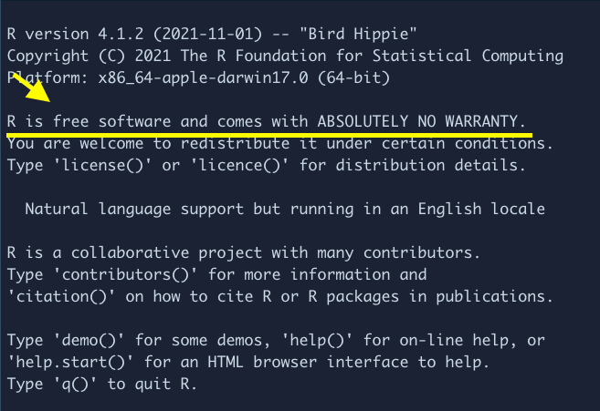
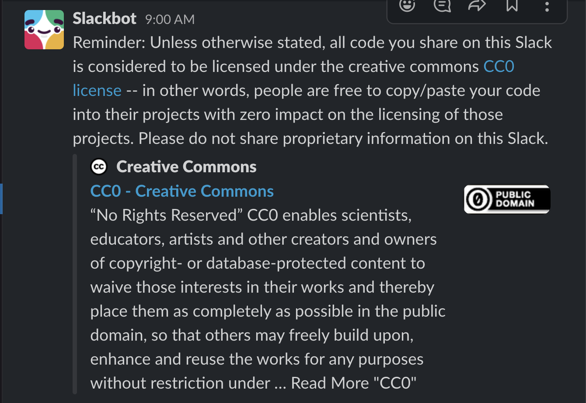
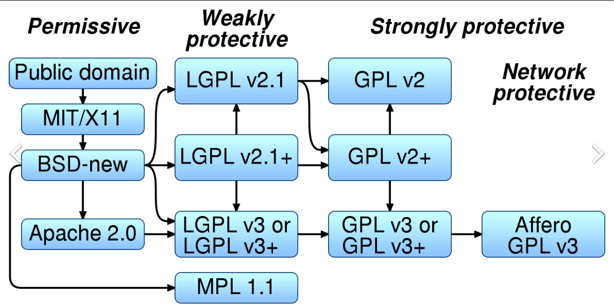

# Licensing

**Learning objectives:**

1. Understand the differences between `Permissive` licenses and `Copyleft` licenses. 
1. Understand what to do when:
    - licensing your own code
    - licensing code received from other people (i.e., pull requests)
    - licensing other people's code you bundle into your own package
1. Be able to describe how the copyright holder is determined 
1. Discuss the process involved when relicensing a package.

## Disclaimer

- **Information presented in this session is not legal advice.**
- I am not a lawyer.
- Seek consultation from a legal professional.
- Focus for tonight: 
  - Inform each other on this topic in the context of R package development.
  - Prepare ourselves to ask the right questions if we have concerns.
  - Prepare us to do the right thing when using other people's code.
  
## Software licensing, a complicated field 

> Software licensing is a large and compicated field, made particularly complex because it lies at the intersection of programming and law. - Hadley Wickham

> Licensing for a package which might be distributed is an important but potentially complex subject. - [Writing R Extensions](https://cran.r-project.org/doc/manuals/r-release/R-exts.html#Licensing)

> Copyright is everywhere - Colin Fay in Licensing R

- Although complex, it's important
  - Not including a license could legally mean:
    - Users can't distribute your package or code.
    - Users may not be able to technically use it.
  - The level of permission given implies how your code can be used:
    - Military or commercial context.
    - Too restrictive, no one can use it.
  - Protect yourself
  
 - Interesting [blog post](https://notstatschat.rbind.io/2019/02/18/absolutely-no-warranty/) regarding the `NO WARRANTY` clause and other statistical analysis tools. 
 
## Major license categories

- `Permissive` licenses
  - very easy going.
  - can be freely copied, modified, and published, and the only restriction is
    the license must be preserved. 
  - `MIT` & `Apache` are most common modern permissive licenses.

- `Copyleft` licenses
  - stricter.
  - `GNU GPL`. 
  - allows you to freely copy and modify the code for personal use, but if you
    publish modified versions or bundle with other code, the modified version or
    complete bundle must also be licensed with the GPL.

## What license should you choose?

### Explore other R packages 

- [`dplyr`](https://github.com/tidyverse/dplyr/blob/main/LICENSE.md): MIT License
- [`lubridate`](https://github.com/tidyverse/lubridate/blob/main/LICENSE.md): GPL
- [`purrr`](https://github.com/tidyverse/purrr/blob/main/LICENSE.md): MIT License
- [`survey`](https://cran.r-project.org/web/packages/survey/index.html/): GPL-2 | GPL-3
- [`R`](https://www.r-project.org/about.html): GPL-2
- [`R Studio`](https://support.rstudio.com/hc/en-us/articles/217801078-What-license-is-RStudio-available-under-): AGPL v3
- [`shiny`](https://github.com/rstudio/shiny/blob/main/LICENSE): GPL-3

### By the numbers

- [2015 Survey of GitHub repos](https://github.blog/2015-03-09-open-source-license-usage-on-github-com/):
  - All programming languages:
    - ~55% use a permissive license
    - ~20% use a copyleft

- The book's analysis:
  - ~70% of CRAN packages use copyleft
  - ~15% use permissive license

### Seek further guidance

- [https://chooselicense.com](https://choosealicense.com/)
- [Licensing R by Colin Fay](https://thinkr-open.github.io/licensing-r/)
- Consult a legal professional

## Code you write

  - Purpose: Choose a license to make it clear how you want people to treat your code.
  
  - `Permissive` license: minimal restrictions.
    -  [MIT license](https://choosealicense.com/licenses/mit/) with
       `use_mit_license()`.
  - `Copyleft` license:  all derivatives and bundles become open source.
    - [GPLv3 license](https://choosealicense.com/licenses/gpl-3.0/) with
      `use_gpl_license()`.
  - Primarily contains data, not code, and with minimal restrictions.
    -  [CC0 license](https://choosealicense.com/licenses/cc0-1.0/) with 
       `use_cc0_license()`
    - Example
        - Code posted to the R4DS Online Learning Community Slack
        
  - Require attribution when data is used.
    - [CC BY license](https://choosealicense.com/licenses/cc-by-4.0/) with 
      `use_ccby_license()`
    - Examples (not package related)
      - [Julia Silge's Blog](https://juliasilge.com/about/)
      - [Alison Hill's Blog](https://www.apreshill.com/about/)
      - [YiHui Xie's Blog](https://yihui.org/knitr/)
      - [The R package's book](https://github.com/hadley/r-pkgs/blob/main/LICENSE)
      - And many more...
  - License code that will not be open sourced.
    - `use_proprietary_license()`
    - CRAN will not distribute these packages

## Copyright holder

  - People who own the underlying copyright of the code.
     - Choose the license (or later can change it).
     - Multiple people/companies = may have copyright to individual contributions
  - Who is the copyright holder?
     - Code written on your own time: you're the copyright holder.
     - Code written on company time: your employer is the copyright holder.
     - Code written under contract: you're the copyright holder unless the contract describes otherwise.
  - Discuss with a legal professional
     - All organizations are different

## Key Files
  - Every license sets the `License` field in the `DESCRIPTION`.
  - Standard form for name of the license:
    - A name and version specification
      - e.g. `GPL (>= 2)`, or `Apache License (= 2.0)`.
    - A standard abbreviation
      - e.g. `GPL-2`, `LGPL-2.1`, `Artistic-2.0`.
    - A name of a license “template” and a file containing specific variables.         The most common case is `MIT + file LICENSE`, where the `LICENSE` file
      needs to contain two fields: the year and copyright holder.
    - Pointer to the full text of a non-standard license, file `LICENSE`.
  - The `LICENSE` file is used in one of two ways:
    1. Templates that require additional details to be complete in the 
       `LICENSE` file. 
    2. Contain the full text of non-standard and non-open source licenses. 
  - `LICENSE.md` includes a copy of the full text of the license.
  - `use .Rbuildignore` to make sure this file is not sent to CRAN.

## More licenses are available
  - Although your choice may be flexible, it's best to follow convention.
    - Not all users will be familiar with licensing, let alone an uncommon license.
    - Writing your own license can cause problems ([JSON](https://www.json.org/license.html))
  - Check out the book for a list of other license options.
  - Need more:
    - Check out [https://opensource.org/licenses/alphabetical](https://opensource.org/licenses/alphabetical).
    
## Relicensing
  - Take time to do some pre-planning
  - Find all non-trivial contributors (scan your `git commit` history)
  - Check the `Authors@R` field in the `DESCRIPTION` to confirm that the 
    package doesn’t contain `bundled code`
      - This may limit your relicensing
  - Get approvals from all the copyright holders/ contributors 
  - Examples:
    - [`generics`](https://github.com/r-lib/generics/issues/49)
    - [`covr`](https://github.com/r-lib/covr/issues/256)
    - [`Interesting issue in ggplot2`](https://github.com/tidyverse/ggplot2/issues/4236)
    
## Packages mainly containing data
  - `use_cc0_license()`: CC0 license
    Data freely available 
    - [`nycflights13`](https://github.com/tidyverse/nycflights13)
    - Question about data focused packages
      - [`sportsdataverse`](https://sportsdataverse.org/)
      - Packages with API methods for data sources
        - [`tidycensus`](https://github.com/walkerke/tidycensus)
      
  - `use_ccby_license()`: CC-BY license.
    Require attribution when someone uses the data

## Code given to you
  - Someone who contributes to your package using a pull request or similar
  - Someone might find some code and choose to bundle it
  - `Contributor License Agreement (CLA)`
      - Copyright is the author's unless stated otherwise in the CLA
  - It’s important to acknowledge the contribution, and it’s good practice to 
    be generous with thanks and attribution

## Code you bundle
  - When might this come up?
      - Create a useful and attractive web page or HTML widgets by using someone
    else CSS or JS library
      - Providing an R wrapper for a simple C or C++ library
      - Copied a small amount of R code from another package to avoid taking 
    a dependency

* **First question:** License compatibility?
  - Before bundling, verify licenses are compatible 
  - When distributing, you can add additional restrictions but cannot remove restrictions
  - Interesting discussion on use of Stack Overflow code
    - Code is CC BY-SA license, which is only compatible with GPLv3
  

Picture from [Wikipedia](https://en.wikipedia.org/wiki/License_compatibility#Compatibility_of_FOSS_licenses)

* How to include
  - Preserve all existing license and copyright statements, and make it as 
    easy as possible for future readers to understand the licensing 
    situation (another good reason to use `git`). 
  - Include some standard metadata in `Authors@R`. 
    - `role = "cph"` to declare that the author is a copyright holder, with 
      a comment describing what they’re the author of.
  - Different (but compatible) license with bundled code: 
      include a `LICENSE.note` file that describes the overall license of 
      the package, and the specific licenses of each individual component.

## Meeting Videos

### Cohort 1

`r knitr::include_url("https://www.youtube.com/embed/C_H1oQZD7m8")`


### Cohort 2

`r knitr::include_url("https://www.youtube.com/embed/8PU_KT5IpWg")`


### Cohort 3

#### Part 1

`r knitr::include_url("https://www.youtube.com/embed/IWB1s0hDi20")`

#### Part 2

`r knitr::include_url("https://www.youtube.com/embed/---BWbMr5B0")`

<details>
<summary> Meeting chat log </summary>

```
#### Part 1
00:05:51	Ryan Metcalf:	Russ Hyde's new Cohort, "JavaScript for R": https://book.javascript-for-r.com/
00:10:18	Isabella Velásquez:	Total Eclipse of the Heart ;D
00:10:32	Ryan Metcalf:	OUTSTANDING!!!!
00:50:52	Ryan Metcalf:	One of my favorite copyright battles was Google's development of the Dvorak language (for Android) which contained some levels of Java functions. When Oracle acquired Sun Microsystems in 2009, one of the first orders of business for Oracle was to go after Google for the a couple of code snippets supporting Android.
00:51:48	Ryan Metcalf:	A good bit of reading, but great as a Legal use case of bridging open and closed source coding. https://www.supremecourt.gov/opinions/20pdf/18-956_d18f.pdf

#### Part 2
00:01:58	Ryan Metcalf:	Fix for BlueTooth: sudo kill bluetoothd
00:04:49	Brendan Lam:	https://twitter.com/lucystats/status/959504698842652672
00:04:57	Brendan Lam:	How to pronounce it (supposedly)
00:05:22	Ryan Metcalf:	Awesome Brendan! great thread!
00:17:32	Ryan Metcalf:	https://creativecommons.org/Government
00:18:59	Ryan Metcalf:	Directly related to the US: https://resources.data.gov/open-licenses/
00:24:16	Ryan Metcalf:	Quick side note: I received a block due to API key. You can acquire one at: http://api.census.gov/data/key_signup.html
00:41:21	Ryan Metcalf:	The Google Verse turned up this link for R as a package is GPL-2 | GPL-3. https://www.r-project.org/Licenses/#:~:text=R%20as%20a%20package%20is,to%20see%20if%20this%20applies.
00:44:14	Isabella Velásquez:	??pivot_longer every day
00:49:28	Rex Parsons:	I think you're right
01:06:38	Isabella Velásquez:	I learned of this add in that helps with roxygen2 tags: https://github.com/matt-dray/snorkel
01:11:24	Ryan Metcalf:	S3 Reference: https://adv-r.hadley.nz/s3.html?q=S3#implicit-class
```
</details>


### Cohort 4

`r knitr::include_url("https://www.youtube.com/embed/VIDURL")`

<details>
<summary> Meeting chat log </summary>

```
LOG
```
</details>
