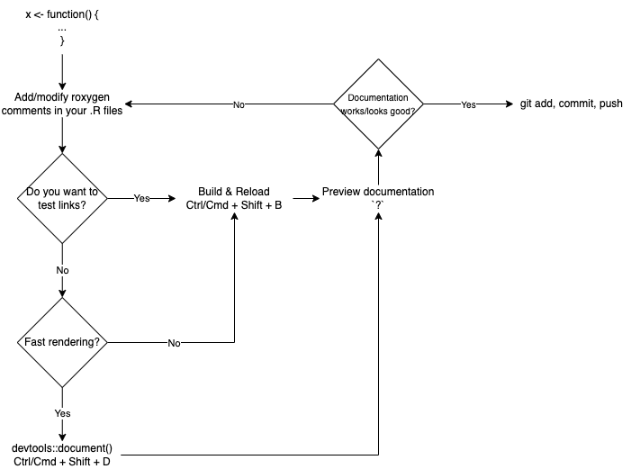

# (PART) Documentation {-}

# Function documentation

**Learning objectives:**

- Describe the benefits of well developed function documentation
- roxygen2 basics
- Discuss the definition of object documentation 
- Demonstrate the object documentation workflow
- Discuss some general formatting and style guidelines

## Why care about object documentation?

- Documentation is an important component of packages 
  - How will users know how to use your package?
  - Inform your future self
  - Inform other contributors

## roxygen2 advantages

- code and documentation co-located
- use markdown rather than learning the markup language of `.Rd`
- automation of `.Rd` boilerplate
- tools for sharing content across documentation topics and vignettes

# roxygen2 basics

## Documentation workflow

Four main steps: 

1. Opening move is add roxygen comments above your functions in your `R/.R` files
2. Run `devtools::document()`
3. Preview documentation with `?function`
4. Rinse and repeat


## roxygen2 comments, blocks, and tags

- Four basic building blocks:
  1. **`#'`** - `roxygen` comment
  1. **Multiple `#` lines** - a block
      - Wrapped at 80 characters (Ctrl/Cmd + Shift + / or reflow comment)
  1. **Tags** - Breaks up the blocks
     - `@tagName details`
  1. **Introduction**
     - First sentence is the title
     - Second paragraph is the description (what does the function do?)
     - Paragraphs >= 3 allow for more detail 
- All objects must have a title and description

- Details are optional

- Blocks and tags give documentation structure

Here's a simple first example: the documentation for `str_unique()`.

```{r}
#' Remove duplicated strings
#'
#' `str_unique()` removes duplicated values, with optional control over
#' how duplication is measured.
#'
#' @param string Input vector. Either a character vector, or something
#'  coercible to one.
#' @param ... Other options used to control matching behavior between duplicate
#'   strings. Passed on to [stringi::stri_opts_collator()].
#' @returns A character vector, usually shorter than `string`.
#' @seealso [unique()], [stringi::stri_unique()] which this function wraps.
#' @examples
#' str_unique(c("a", "b", "c", "b", "a"))
#'
#' # Use ... to pass additional arguments to stri_unique()
#' str_unique(c("motley", "mötley", "pinguino", "pingüino"))
#' str_unique(c("motley", "mötley", "pinguino", "pingüino"), strength = 1)
#' @export
str_unique <- function(string, ...) {
  ...
}
```

## Key markdown features

1. Backticks for inline code
```{r}
#' I like `thisfunction()`, because it's great.
```

1. Square brackets for auto-linked function

```{r}
#' It's obvious that `thisfunction()` is better than [otherpkg::otherfunction()]
#' or even our own [olderfunction()].
```

1. Vignettes

-   `vignette("rd-formatting", package = "roxygen2")`

-   `vignette("reuse", package = "roxygen2")`

-   `vignette("linking", package = "pkgdown")`

1. Lists

```{r}
#' Best features of `thisfunction()`:
#' * Smells nice
#' * Has good vibes
```

# Title, description, details

## Title recommendations

1. Sentence case
1. not end in a full stop
1. followed by a blank line
1. succinct description of function

Bad titles: 

-   `str_detect()`: Detect the presence or absence of a pattern in a string
-   `str_extract()`: Extract matching patterns from a string
-   `str_locate()`: Locate the position of patterns in a string
-   `str_match()`: Extract matched groups from a string

Good titles:

-   `mutate()`: Create, modify, and delete columns
-   `summarise()`: Summarize each group to fewer rows
-   `filter()`: Subset rows using column values
-   `select()`: Subset columns using their names and types
-   `arrange()`: Arrange rows by column values

## Description recommendation

1. summarize goal of the function in single paragraph
1. Explicitly tag `@description` if multi-paragraph (or just need an empty line)
1. Write description after you've come back and forgot what your function does

## Details recommendation

1. most functions don't need this
1. use informative markdown headings

# Arguments

- This is where most of the work will be
- Use `@param` tag
- succinct summary of the inputs and what parameter does
- best practice to describe default argument values even if more work when they later change
- list fixed set of possible parameter values
- bulleted lists possible

## Multiple Arguments

document tightly coupled arguments by separating names with commas

```{r}
#' @param x,y A pair of character vectors.
```

## Inheriting Arguments

`@inheritParams`: reuse parameter documentation
      - From source `@inheritParams function`
      - From another package `@inheritParams package::function`
      
```{r inherit_params_example, eval=FALSE}
#' @param a This is the first argument.
foo <- function(a) a + 10

#' @param b This is the second argument.
#' @inheritParams foo
bar <- function(a, b) {
  foo(a) * 10
}

# Equivalent to

#' @param a This is the first argument.
#' @param b This is the second argument.
bar <- function(a, b) {
  foo(a) * 10
}
```

# Return Value

`@returns`
     - Describes the output from the function.

# Examples

`@examples`
     - Provides executable code on how to use the function in practice
     - Must run without errors or use `\dontrun{}`
     - **Keep in mind:** Most users will look at examples first 

Tension between readable and realistic example code vs. no errors and side effects

Examples executed in 4 situations:

1. interactively with `example()`
1. `R CMD check` on your computer(s)
1. `R CMD check` by CRAN
1. pkgdown website building

## Contents

- Show basic functionality
- highlight easy to miss features
- avoid edge cases 
- sectioning is awkward
- try to use built-in datasets

## Leave the world as you found it

There is no way to schedule clean up in examples like there are in functions and testing.

## Errors

If you need to demonstrate an error you can
- wrap code in `try()`
- wrap code in `\dontrun{}`

Recommend using `try()` 

## Dependencies and conditional execution

Ok to do `library()` in the examples as
- expect suggested packages available during `R CMD check`
- cost of putting code inside `{...}` is high

Recommendation for conditional cases is to use `@examplesIf` tag
- hides machinery from users
- example code renders in pkgdown
- doesn't break CRAN's prohibition of putting code in `\dontrun{}`

## Intermixing examples and text

Alternative is using RMarkdown but downsides:
- code in ````R` blocks is never run
- codes in ````{r}` is run every time you document

# Re-using documentation

## Multiple functions

`@rdname`: document multiple functions in one place that have a lot in common
      - Use with caution. Can lead to confusing documentation.

## Inheriting documentation

-   `@inherit source_function` will inherit all supported components from `source_function()`.

-   `@inheritSection source_function Section title` will inherit the single section with title "Section title" from `source_function()`.

-   `@inheritDotParams` automatically generates parameter documentation for `...` for the common case where you pass `...` on to another function.


## Child documents

Can call a `.Rmd` file for frequently repeated text

# Past edition notes:

## Object documentation defined

- Focus for tonight is on object documentation
  - What do you think when you hear the word object?
  - Accessed via `?` or `help()`
- **Object documentation**: reference documentation. 
  - Purpose is to serve as a reference (e.g., a dictionary entry) 
  - Great use case for standardized naming conventions (e.g., `stringr` package)
- Difference between object documentation and vignettes
  - **Object documentation** = A short-form reference guide
  - **Vignettes** = A long-form document on how to use package objects to solve a problem


## Object documentation, an overview


- Documentation files are rendered from a syntax loosely based on `LaTex`.
  - `HTML`
  - Plain text
  - PDF
  - More on this syntax can be found in the [`R extensions manual`](https://cran.r-project.org/doc/manuals/R-exts.html#Rd-format)
- [`roxygen2`](https://roxygen2.r-lib.org/) provides a more user-friendly syntax to create documentation 
  - Comments using `@tags` >> `man/.Rd` files >> `HTML` or PDFs
  - Code is intermingled with documentation
  - Handles some boilerplate set up
  - Abstracts away the differences for documenting different objects
  - Manages the `NAMESPACE` (Chapter 13) 
  
## The documentation workflow

- Two workflows
  1. Fast, but links don't work
  2. Slow, but the links work
    - You may need to adjust some settings if build and reload doesn't work 
  
  
  


## Documenting functions

- Most commonly documented object
- Three common tags:
  1. `@param name description`: describes the function's inputs or parameters.
     - These need to be documented
     - Multiple arguments can be documented in one place `@param x,y description`
  1. `@examples`
     - Provides executable code on how to use the function in practice
     - Must run without errors or use `\dontrun{}`
     - **Keep in mind:** Most users will look at examples first 
  1. `@return`
     - Describes the output from the function.

- Addional tags
  - `@section`
  - `@seealso`
  - `@family`
  - `@alias`
  - `@keyword`
  - Checkout the [Rd (documentation) tags vignette](https://roxygen2.r-lib.org/articles/rd.html)

- Keep style conventions top of mind
  - Check out the book for more details

- [`ggplot2` example](https://github.com/tidyverse/ggplot2/blob/main/R/aes.r)

## Documenting datasets

- A different process, see [Chapter 14](https://r-pkgs.org/data.html).

## Documenting packages

- Provide a help page for your package as a whole
  - `package?foo`
- Intended to describe the most important components of the package
- Great place to put package level import statements
- [`ggplot2` example](https://github.com/tidyverse/ggplot2/blob/main/R/ggplot2-package.R)

## Documenting classes, generics, and methods

- S3 generics
    - Are regular functions, so document them as such.
    - [`dplyr::glimpse()` example](https://github.com/r-lib/pillar/blob/main/R/glimpse.R)
    
- S4 classes and methods
    - Use `@slot` to document the slots of the class.
    - Aim to keep all your documentation together
    - Use `@rdname` or `@describeIn` to keep docs together
    - Control ordering of code loading by using `@include`  
    
- RC (reference classes)
    - Uses the docstring in the method for the documentation
      - Is included within the 'Methods' section
    - You now only need one `roxygen` block per class
    - Uses the `@field`
    - See the `account` example in`regexcite`
    
## A note about special characters

- `@` denotes a tag, so use `@@` for a literal `@`
- `%` denotes start of a `LaTex` comment, so escape for a literal `%` `\%`
- Escape your backslashes (e.g., `\\`)

## Do repeat yourself

- Self-contained documentation vs. [`DRY` (don't repeat yourself)](https://en.wikipedia.org/wiki/Don%27t_repeat_yourself)
- Limit user frustration resulting from navigating multiple help files
- Two ways to handle:
   1. `@inheritParams`: reuse parameter documentation
      - From source `@inheritParams function`
      - From another package `@inheritParams package::function`
      
```{r inherit_params_example2, eval=FALSE}
#' @param a This is the first argument.
foo <- function(a) a + 10

#' @param b This is the second argument.
#' @inheritParams foo
bar <- function(a, b) {
  foo(a) * 10
}

# Equivalent to

#' @param a This is the first argument.
#' @param b This is the second argument.
bar <- function(a, b) {
  foo(a) * 10
}
```

   1. `@describeIn` or `@rdname`: document multiple functions in one place
      - Use with caution. Can lead to confusing documentation.
      - See the `foobar` example
      - See the `arithmetic` example

## Text formatting

- Check out the [reference sheet](https://r-pkgs.org/man.html#text-formatting) in the book
  - Use as a reference
- Generally follows a `LaTex` like syntax
  - `\formatLikeThis{yourText}`
- Formatting that can be applied:
  - Character formatting
  - Linking to other docs or materials
  - Lists
  - Mathematical notation
  - Tables

## Meeting Videos

### Cohort 1

`r knitr::include_url("https://www.youtube.com/embed/BN0mBuuLKz8")`

`r knitr::include_url("https://www.youtube.com/embed/oCbDqT8uIHY")`


### Cohort 2

`r knitr::include_url("https://www.youtube.com/embed/--GzGdfhCsI")`


### Cohort 3

#### Part 1

`r knitr::include_url("https://www.youtube.com/embed/---BWbMr5B0?start=1821")`

#### Part 2

`r knitr::include_url("https://www.youtube.com/embed/F3DnD4N-s5w")`

<details>
<summary> Meeting chat log </summary>

```
#### Part 1
00:01:58	Ryan Metcalf:	Fix for BlueTooth: sudo kill bluetoothd
00:04:49	Brendan Lam:	https://twitter.com/lucystats/status/959504698842652672
00:04:57	Brendan Lam:	How to pronounce it (supposedly)
00:05:22	Ryan Metcalf:	Awesome Brendan! great thread!
00:17:32	Ryan Metcalf:	https://creativecommons.org/Government
00:18:59	Ryan Metcalf:	Directly related to the US: https://resources.data.gov/open-licenses/
00:24:16	Ryan Metcalf:	Quick side note: I received a block due to API key. You can acquire one at: http://api.census.gov/data/key_signup.html
00:41:21	Ryan Metcalf:	The Google Verse turned up this link for R as a package is GPL-2 | GPL-3. https://www.r-project.org/Licenses/#:~:text=R%20as%20a%20package%20is,to%20see%20if%20this%20applies.
00:44:14	Isabella Velásquez:	??pivot_longer every day
00:49:28	Rex Parsons:	I think you're right
01:06:38	Isabella Velásquez:	I learned of this add in that helps with roxygen2 tags: https://github.com/matt-dray/snorkel
01:11:24	Ryan Metcalf:	S3 Reference: https://adv-r.hadley.nz/s3.html?q=S3#implicit-class
```
</details>


<!--
### Cohort 4

`r knitr::include_url("https://www.youtube.com/embed/VIDURL")`

<details>
<summary> Meeting chat log </summary>

```
LOG
```
</details>
-->


<!--
### Cohort 5

`r knitr::include_url("https://www.youtube.com/embed/VIDURL")`

<details>
<summary> Meeting chat log </summary>

```
LOG
```
</details>
-->
