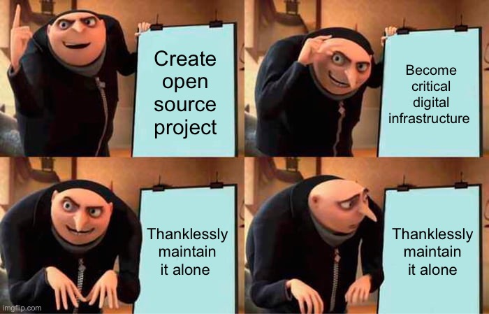
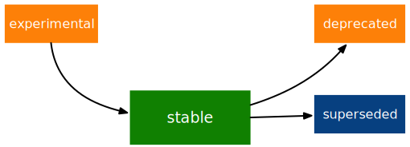
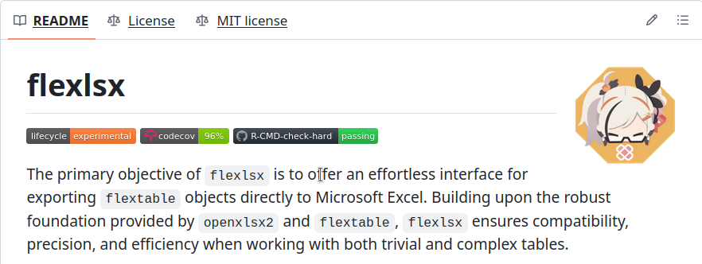

# Lifecycle

**Learning objectives:**

- Communicating the change
- Studying to prior versions
- Package version number
- Backward compatible vs breaking changes
- Patch release vs minor release
- Lifecycle stages
- Deprecation process

## The challenge {-}

Balancing the interests of various stakeholders:

- The maintainer(s)
- The existing users
- The future users



## Communicating the change {-}

- Package **version number** should difference:
  - *Patch* releases
  - *Major* releases
  
- Function or argument should be explicit about their **lifecycle stage**:
  - *Experimental*
  - *Stable*
  - *Superseded*
  - *Deprecated*

- Enact **deprecation process** in a phased way.

## When do a package change? {-}

<br>

- Package states accessible via the Git history are only useful for the maintainer.

<br>

- A meaningful change due to **increasing the package version number** and **release it** to **CRAN**.

## Studying to prior versions {-}

- The (unofficial) cran organization on GitHub where each commit represents a CRAN release:
  - https://github.com/cran/usethis/commits/HEAD
  
<br>
  
- Prior CRAN package bundles (`.tar.gz` files):
  - https://cran.r-project.org/src/contrib/Archive/usethis/

<br>

- The repository where usethis is actually developed: 
  - https://github.com/r-lib/usethis/commits/HEAD

## Package version number {-}

Minimum requirements:

- At least two integers
- Separated by either `.` or `-`

## Package version number {-}

The `base::package_version()` function:

- Parses a package version string into a proper S3 class.

```{r}
class(package_version("1.0"))
```

## Package version number {-}

The `base::package_version()` function:

- Makes easier to compare versions if **any of comparators** has the `package_version` class..

```{r}
"2.0" > "10.0"

package_version("2.0") > "10.0"
```

## Package version number {-}

To determine which version of a package is installed use `utils::packageVersion()`.

```{r}
packageVersion("usethis")


packageVersion("usethis") > package_version("10.0")
```

## Tidyverse package version conventions {-}

- Always use `.` as the separator, never `-`.

- A released version number consists of three numbers, `<major>.<minor>.<patch>`.
  - Always spell out the three components, `1.0.0`.
  - If all good, in most of releases the `<patch>` must be `0`.

- An in-development package has a fourth component, `<major>.<minor>.<patch>.<dev>`:
  - The development version starts at 9000 to provides a clear signal.
  - Increment the development version, e.g. from `9000` to `9001`, if you've added an important feature and you (or others) need to be able to detect or require the presence of this feature.


## Changes type: backward compatible {-}

The code still works, but could produce a different result in some edge cases:

- Increasing the set of valid inputs.
- Fixing a bug (*users write code that “depends” on a bug*)
- Adding a function (*could introduce a conflict in user code*)
- Adding an argument (*could affect position-based argument matching*)
- Changing the text of a print method or error (*could affect if code relies on an error message from your package*)

Run the tests of your **reverse dependencies** and see if your proposed change breaks anything as it can help to **guide development**.


## Backward compatibility angles {-}

- Degree of **change in behaviour** like making something that used to be possible into an error.

- How the changes fit into the **design of the package** like changing an utility that gets called in all user-facing.

- How much existing usage is affected


## Changes type: breaking change {-}

> A change is breaking if it causes a CRAN package that was previously passing `R CMD check` to now fail AND the package’s original usage and behavior is correct.

- Removing a function
- Removing an argument
- Narrowing the set of valid inputs to a function


## Major vs minor vs patch release {-}

If the current package version is `0.8.1.9000`

- Increment patch, e.g. `0.8.2` for a **patch release**:
  - You’ve fixed bugs
  - You haven’t added any significant new features
  - There are no breaking changes
  
- Increment minor, e.g. `0.9.0`, for a **minor release**:
  - Include bug fixes
  - New features
  - Backward compatible changes
  
- Increment major, e.g. `1.0.0`, for a **major release**:
  - Add braking changes
  - From a marketing perspective, save **important new features** for a major release.
  - `1.0.0` indicates that your package is feature complete with a stable API.
  
> Minor and major release should share the good news in blog posts.

## Package version tools {-}

- `usethis::create_package()` starts with version number `0.0.0.9000`.

- `usethis::use_version()` increments `Version` in `DESCRIPTION` and adds a new heading in `NEWS.md`. If called with no arguments it presents a **helpful menu**.

```r
usethis::use_version()
#> Current version is 0.1.
#> What should the new version be? (0 to exit) 
#> 
#> 1: major --> 1.0
#> 2: minor --> 0.2
#> 3: patch --> 0.1.1
#> 4:   dev --> 0.1.0.9000
#> 
#> Selection: 
```

## Cons of breaking change {-}

Package maintainers need to exercise considerable caution and care before introducing a breaking as:

- Most R users **don’t manage package versions** in a very intentional way.

- It’s quite **easy to upgrade** a package to a new major version without really meaning to.

- If you constantly make breaking changes, **users will become very frustrated**.


## Cons resistance to breaking change {-}

- Can discourage adoption by **new users**.

- Makes harder it is to **develop new features** or **fix old mistakes**.

- Makes harder to **recruit new contributors**.


## Package evolution approach {-}

- Lifecycle stages at different levels:
  - Entire package
  - Functions
  - Arguments

<br>  

- Conventions and functions to use when transitioning

## Lifecycle stages and badges {-}



- **Stable:** Breaking changes should be **rare** and should happen **gradually**. They don't need any use a badge

- **Experimental:** The maintainer reserves the right to change it without much of a deprecation process. 

- **Deprecated:** Initially triggers a deprecation warning with information about preferred alternatives until is removed.

- **Superseded:** For legacy functionality is preserved as if in a time capsule.


## Setting badges up {-}

1. Call `usethis::use_lifecycle()` to do some one-time setup.

```{r eval=FALSE}
usethis::use_lifecycle()
#> ✔ Adding 'lifecycle' to Imports field in DESCRIPTION
#> • Refer to functions with `lifecycle::fun()`
#> ✔ Adding '@importFrom lifecycle deprecated' to 'R/somepackage-package.R'
#> ✔ Writing 'NAMESPACE'
#> ✔ Creating 'man/figures/'
#> ✔ Copied SVG badges to 'man/figures/'
#> • Add badges in documentation topics by inserting one of:
#>   #' `r lifecycle::badge('experimental')`
#>   #' `r lifecycle::badge('superseded')`
#>   #' `r lifecycle::badge('deprecated')`
```

## Setting badges up {-}

2. Use the `lifecycle::badge()` function to place the badges under `@description` and `@param` blocks.

```{r eval=FALSE}
#' @description
#' `r lifecycle::badge("superseded")`
#' `top_n()` has been superseded in favour of ...
```

```{r eval=FALSE}
#' @param path `r lifecycle::badge("deprecated")` Use the `file` argument
#'   instead.
```

## Setting badges up {-}

3. Call `usethis::use_lifecycle_badge()` to indicate the lifecycle of an entire package in the `README`.



## Deprecating a function {-}

Inform your user that they’re using a deprecated feature by using the `lifecycle::deprecate_warn()` every 8 hours or always if `always = TRUE`.

If you only wants to inform to a package maintainer you can use `lifecycle::deprecate_soft()` as an alternative.

```{r eval=FALSE}
# old function
plus3 <- function(x, y, z) {
  lifecycle::deprecate_warn("1.0.0", "plus3()", "add3()")
  add3(x, y, z)
}

plus3(1, 2, 3)
#> Warning: `plus3()` was deprecated in somepackage 1.0.0.
#> ℹ Please use `add3()` instead.
#> [1] 6
```

**Note:** If you’re using base R only, the `.Deprecated()` and `.Defunct()` can be used.

## Deprecating an argument {-}

Use `lifecycle::deprecated()` with `lifecycle::deprecate_warn()`.

```{r eval=FALSE}
write_file <- function(x,
                       file,
                       append = FALSE,
                       path = deprecated()) {
  if (is_present(path)) {
    lifecycle::deprecate_warn("1.4.0", "write_file(path)", "write_file(file)")
    file <- path
  }
  ...
}

readr::write_file("hi", path = tempfile("lifecycle-demo-"))
#> Warning: The `path` argument of `write_file()` is deprecated as of readr
#> 1.4.0.
#> ℹ Please use the `file` argument instead.
```


## Deprecation helpers {-}

If a deprecation affects code in multiple places it's better to create an internal helper to centralize the deprecation logic.

```{r eval=FALSE}
drive_publish <- function(file, ..., verbose = deprecated()) {
  warn_for_verbose(verbose)
  # rest of the function ...
}
```

## Deprecation helpers {-}

- If the user leaves verbose unspecified or if they request verbose = TRUE (default behavior), warn_for_verbose() does nothing. 

- But if they explicitly ask for verbose = FALSE, we throw a warning.

```{r eval=FALSE}
warn_for_verbose <- function(verbose = TRUE,
                             env = rlang::caller_env(),
                             user_env = rlang::caller_env(2)) {
  # This function is not meant to be called directly, so don't worry about its
  # default of `verbose = TRUE`.
  # In authentic, indirect usage of this helper, this picks up on whether
  # `verbose` was present in the **user's** call to the calling function.
  if (!lifecycle::is_present(verbose) || isTRUE(verbose)) {
    return(invisible())
  }

  lifecycle::deprecate_warn(
    when = "2.0.0",
    what = I("The `verbose` argument"),
    details = c(
      "Set `options(googledrive_quiet = TRUE)` to suppress all googledrive messages.",
      "For finer control, use `local_drive_quiet()` or `with_drive_quiet()`.",
      "googledrive's `verbose` argument will be removed in the future."
    ),
    user_env = user_env
  )
  # only set the option during authentic, indirect usage
  if (!identical(env, global_env())) {
    local_drive_quiet(env = env)
  }
  invisible()
}
```


## Dealing with change in a dependency {-}

If the `Imports` dependency package has already been released:

- Bump the minimum version you declare for it in `DESCRIPTION` (*users who update your package will be forced to update the other package*)

- Use the new functionality unconditionally


## Dealing with change in a dependency {-}

You could make your package work with both new and old versions.

```{r eval=FALSE}
your_existing_function <- function(..., cool_new_feature = FALSE) {
  if (isTRUE(cool_new_feature) && packageVersion("otherpkg") < "1.0.0") {
    message("otherpkg >= 1.0.0 is needed for cool_new_feature")
    cool_new_feature <- FALSE
  }
  # the rest of the function
}

your_new_function <- function(...) {
  if (packageVersion("otherpkg") < "1.0.0") {
    stop("otherpkg >= 1.0.0 needed for this function.")
  }
  # the rest of the function
}
```


## Dealing with change in a dependency {-}

If you’re responding to not-yet-release:
  - You can change to work the function before and after the change.
  - To release your package at any time.
  
```{r eval=FALSE}
your_function <- function(...) {
  if (packageVersion("otherpkg") >= "1.3.9000") {
    otherpkg::their_new_function()
  } else {
    otherpkg::their_old_function()
  }
  # the rest of the function
}
```


## Superseding a function {-}

Conditions:

- The function is no longer the preferred solution to a problem.
- It has enough usage and history that you don’t want to initiate the process of removing it.

Examples:

- `tidyr::spread()` was superseded by `tidyr::pivot_wider()`
- `tidyr::gather()` was superseded by `tidyr::pivot_longer()`

They don’t receive any new innovations.

## Opt-in to the legacy behaviour {-}

- In tidyr 1.0.0,the interface of `tidyr::nest()` and `tidyr::unnest()` changed. But the old interface remains available via `tidyr::nest_legacy()` and `tidyr::unnest_legacy()`. 

- dplyr 1.1.0 takes advantage of a much faster algorithm for computing groups, but the global option `dplyr.legacy_locale` allows a user to explicitly request the legacy behaviour.


## Meeting Videos

This was a somewhat different chapter for cohorts 1-3.

### Cohort 1

`r knitr::include_url("https://www.youtube.com/embed/Dh-kbknqa3E")`


### Cohort 2

`r knitr::include_url("https://www.youtube.com/embed/aU4pQTki_tg")`


### Cohort 3

`r knitr::include_url("https://www.youtube.com/embed/G852fyvKl8A")`

<details>
<summary> Meeting chat log </summary>

```
00:37:08	Rex Parsons:	https://fromthebottomoftheheap.net/2020/04/30/rendering-your-readme-with-github-actions/
00:59:25	Ryan Metcalf:	Was it `cast1?
```
</details>

### Cohort 3 Extra: Jenny Bryan

`r knitr::include_url("https://www.youtube.com/embed/5LktoXh7WvY")`

<details>
<summary> Meeting chat log </summary>

```
00:02:39	Jon Harmon (jonthegeek):	Questions: (link no longer available)
00:03:58	Ryan Metcalf:	I sent the link to Shel and Lucy too.
00:30:18	collinberke:	+1 for gargle
00:42:26	Rebecca Butler:	this was such a great question (and answer). thank you!
00:45:05	Ryan Metcalf:	https://github.com/search
00:50:32	Jon Harmon (jonthegeek):	https://r-universe.dev/search/
01:01:40	Jon Harmon (jonthegeek):	Vote up questions to help me choose the last one or two!
Questions: (link no longer available)
01:03:29	Jon Harmon (jonthegeek):	https://design.tidyverse.org/
01:04:10	Jon Harmon (jonthegeek):	https://style.tidyverse.org/error-messages.html
01:09:54	Jon Harmon (jonthegeek):	use_tidy_github_actions
01:10:34	Jon Harmon (jonthegeek):	use_tidy_upkeep_issue
01:13:42	Rebecca Butler:	Thank you so, so much!!
01:17:17	collinberke:	Thank you!
01:17:17	Brendan Lam:	Thank you!
```
</details>


### Cohort 4

`r knitr::include_url("https://www.youtube.com/embed/RIOdG96LyGc")`

<details>
<summary> Meeting chat log </summary>

```
00:55:28	Neil Birrell: usethis::use_lifecycle()
01:00:18	Neil Birrell: Warning message:
Problem while computing `..1 = across(where(is.factor) & !is.ordered, as.character)`.
ℹ️ Predicate functions must be wrapped in `where()`.

# Bad data %>% select(is.ordered)

# Good data %>% select(where(is.ordered))

ℹ️ Please update your code. This message is displayed once per session.
```
</details>
